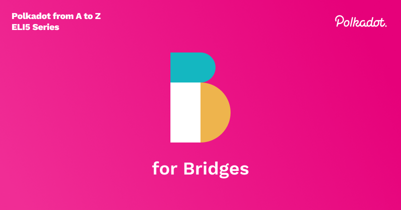

## What are Bridges?

Bridges are connections to the Polkadot relay chain that have special properties which allow them to communicate with other blockchains. They’re secured via the Polkadot consensus and are maintained by a group of participants called Collators which we will cover in next week's post for letter C. Bridges are the cornerstone of interoperability that Polkadot is looking to deliver in the blockchain ecosystem. We can think of them as communication channels for isolated blockchains, such as Bitcoin or Ethereum, that can send messages, mint new coins, securely lock funds, and burn tokens, among other functionality. With a bridge, we enable more complex applications to be developed that can use multiple blockchains for functionality, hence combating the issue of chain maximalism.

## How do Bridges work?

Let's consider an example; we have two bridges, one for BTC and another for ETH, and Bob wants to transfer BTC to ETH. Polkadot can facilitate this transaction via the use of it’s messaging protocol that allows bridges to communicate with each other, this is called XCMP. The BTC bridge will send a message to the ETH bridge with the amount of BTC and Bobs ETH account into which the bridge will deposit the newly minted ETH token, let's call this PBTC. The token minting logic is executed by an Ethereum smart contract, which the bridge can trigger. Once the transaction happens on both bridges and the PBTC is minted at a 1:1 ratio as the sent BTC amount, the PBTC is deposited to Bob's ETH account.
Meanwhile, the original BTC is locked up in the BTC bridge, which will be accessible only by the original sender of the transaction. So if Bob ever wants to transfer the PBTC back into his BTC account, the same smart contract can burn the PBTC on the Ethereum blockchain, take the locked up 1:1 and send it back to Bob’s BTC account. This is all secured by the bridge's Collators, synchronized with the consensus of the bridged blockchain and the Polkadot blockchain. 

See this video for a visual explanation of this process:
How Bitcoin and Ethereum can Cooperate and Collaborate Through Polkadot with Bruno Skvorc

:::info

Learn more about how Bitcoin and Ethereum can cooperate and collaborate through Polkadot in [this video](https://www.youtube.com/watch?v=rvoFUiOR3cM) by Bruno Skvorc.

:::

## How can we achieve Bridges?

There are a couple ways to develop a Bridge on Polkadot. Primary way is to use the Bridge [pallet](./terms/pallet) through the Substrate framework, which the Polkadot and Kusama blockchains are also built with. Another way is to use smart contracts, especially if the blockchain being bridged is not a Substrate chain. For example, bridging Ethereum will require this approach where a smart contract living on Ethereum can execute the logic that the bridge requires. And lastly we can use Higher-order protocols like XClaim, a base protocol on which we can build bridges on top of. This is only recommended if the asset being bridged does not have a smart contract platform on-chain, such as BTC.

## What are some projects that’re building Bridges, and how can you build a Bridge?

Bridges are software that needs to be written and maintained, so what’re some examples of this in the real world? Interoperability in a decentralized, trustless way is a difficult endeavor. At Web3 Foundation, we fund different applications looking to build bridges, such as ChainSafe and Centrifuge, through our grants program. Another Web3 funded project called PolkaBTC has developed a Substrate bridge to BTC. And ChainX, as mentioned earlier, is a protocol that can be utilized to develop bridges, and a BTC bridge has been built using that.
If you’re interested in building your bridge, start by looking into the Parity Bridges Common repository, where the team at Parity have put together a collection of valuable components when building bridges.