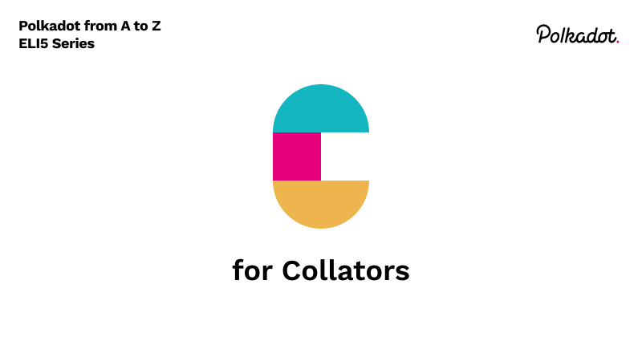

Collate (verb):
- To examine and compare carefully to note points of disagreement.
- To assemble in proper numerical or logical sequence.

Collators are the maintainers of Parachains, which we will cover in more detail when we get to letter P. As a node on the network they have an important task, and that is to keep track of both the state of the Polkadot relay chain as well as maintain the state of the given Parachain that they run on. They do this by running a full node of the relay chain and a full node of the parachain and then building parachain blocks along with a proof of validity for those blocks, which gets proposed to the Polkadot relay chain validators. Once a block is proposed, they cannot start working on the next block until the relay chain validators accept the validity of the proposed block.
Using Cross-chain message passing(XCMP), which will be covered in letter X, Collators can communicate with other Collators of different parachains. This is imperative for allowing multi chain applications to work seamlessly.
If you’re curious about how the technical details of Collators work, check out Cumulous, a set of tools created by Parity to build Polkadot parachains. 

Workshop/tutorial: https://substrate.dev/cumulus-workshop/#/  
Cumulus code: https://github.com/paritytech/cumulus/. 
