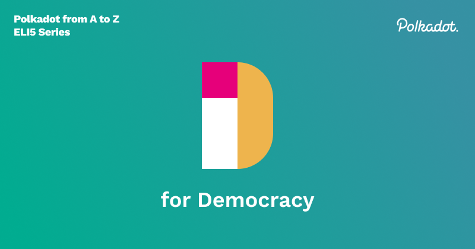

Democracy is a form of governance that society has been practicing in different forms for centuries.
At its purest form, it is the decentralization of power. It first appeared in the 5th century BC
derived from the Greek word meaning “rule of the people'' and 26 centuries later, taking form in
Polkadot, the application of Democracy can be thought of as “rule of the stakeholders”. It acts as
the **governance** mechanism through which only agreed upon changes to the network by its
stakeholders(participants) can pass. The network must function as a decentralized system, which also
happens to be how it handles code updates. When a new functionality is proposed, the network
participants, the DOT holders, vote on it. And if it passes the Democratic process, it will
automatically call the `set_code` function, which will update the runtime code(a WebAssembly blob,
which we will cover later this year with letter W) of the network. This is how Polkadot works around
hard forks which most other blockchains need to use to update their code.

So how does the system work? The flow follows - **proposal of referenda > voting > enactment**.
Please refer to the [wiki](https://wiki.polkadot.network/docs/maintain-guides-democracy) for a
deeper dive into each part.

## Proposal of referenda

In Polkadot, the main application of Democracy comes from a public referendum. Referendums are
simple, inclusive, stake weighted voting mechanisms, and they start with a proposal, which can be
enacted in a few different ways:

- Publicly submitted proposals
- Proposals submitted by the council, either through a majority or unanimously
- Proposals submitted as part of the enactment of a prior referendum
- Emergency proposals submitted by the Technical Committee and approved by the Council

## Voting on referendum proposals

Proposing requires you to bond some tokens, and once the proposal has been made, the tokens are
locked until the proposal has been “tabled”. Meaning that there was a voting period. Bonded tokens
have a lock period, and in Polkadot one lock period is 28 days, and Kusama is eight days. Once a
proposal has been tabled, voting can begin. In reality, getting voting turnouts to be 100% is
extremely rare, so we have developed Adaptive Quorum Biasing. In simple terms, this tool allows the
network to intelligently adjust the amount of aye or nay votes required to successfully pass or not
pass a referendum based on the participant turnout.

## Enactment

Every approved proposal will have a period before it is enacted, that is, when the set_code function
is called. We call this the delayed enactment period, and it allows participants that do not agree
with the new update to leave the network. Also, those who voted for the proposal will have their
bonded DOT locked until the upgrade is executed.

## Council

Any DOT holder can become elected to the council. This a delegated group of stakeholders that are
elected through a rotating approval vote, meaning that the seats in coun cil are voted on one at a
time. Like a few other network parts, the elections use the
[sequential Phragmén method](https://wiki.polkadot.network/docs/learn-phragmen). Polkadot currently
has 13 council seats and is planning to eventually have 24, while Kusama has 19. Candidates for
council bond their DOT to be voted for, and their DOT is returned when elected. Top runner-ups are
persisted until the next election, meaning their bond stays locked till the next seat is up for
election. Council terms are seven days on Polkadot and one day on Kusama. They control the treasury,
propose referenda, cancel dangerous and non-controversial referenda, and elect the technical
committee. The existence of the council allows the network to have a trusted group that represents
the absent participants to make sure Democracy is functioning as intended.

Check out [this](https://www.crowdcast.io/e/governance-on-polkadot--/register) crowdcast which dives
deeper into the governance of Polkadot.
