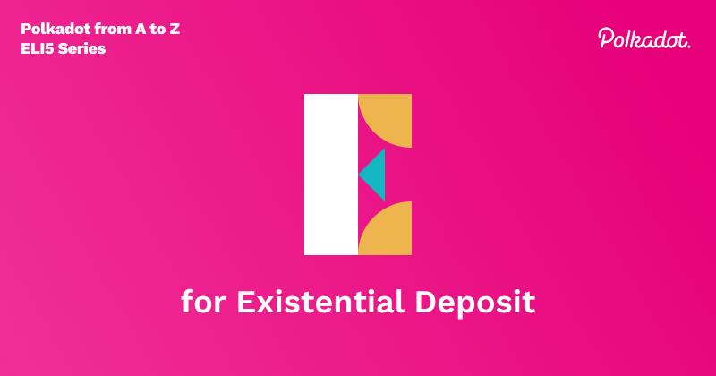

## Existential Deposit and reaping

Accounts must have a minimum balance to exist on-chain. This minimum balance, called an existential deposit (ED), is used as a financial incentive to keep wallets alive. If a wallet's balance falls below the ED, it is considered a dust account, and will be removed from the on-chain data. Once all references to the account have been removed, the account can be reaped (completely emptied). 

The ED on Polkadot is **1 DOT** and Kusama is **0.0000333333 KSM**. 

Reaping does not mean the account is no longer usable, however. The keys still exist in the wallet and can be used in the future, and funds can still be transferred to the account, as long as the total funds in the account will exceed the ED. However, if the account was previously reaped, the reaped funds are not recoverable. In order to protect your account from going below the existential deposit amount, the wallet on PolkadotJS has a keep-alive option which will not let transactions take place which would otherwise put the account balance under the ED amount. 

If you are a validator, be careful not to deposit any staking rewards to a reaped account, or else those funds will be lost and un-recoverable.
