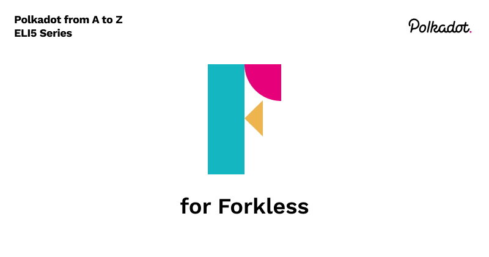

## Forking

A fork is when a codebase is copied and developed separately from the original version. With open-source software, this is legal, though forks can also happen in licensed software, both legally and illegally. In the realm of blockchain and cryptocurrency projects, forks frequently occur, meaning not only do new copies of the codebase get created and developed as separate projects, but sometimes even specific updates on the same codebase require forks. 
Traditional blockchains like Bitcoin and Ethereum require forks because of their architecture. Bitcoin has been forked thousands of times and has hundreds of forks that became legitimate blockchain projects; each copy has been developed differently from the original. For example, Bitcoin Cash was a fork of Bitcoin, and so was Bitcoin Gold. But also some not-so-apparent forks include Ethereum and Litecoin. And sometimes, there are levels, for example, DogeCoin was a fork of Lucky Coin, which was a Fork of Litecoin, which is a fork of Bitcoin.

## Runtime

Runtime is the environment in which a piece of software gets executed. This includes the hardware requirements and software changes. An upgrade in runtime is indicated by a difference in the version, i.e., 1.0.0 to 2.0.0

## Hard Fork

A hard fork can be a software upgrade to a network or a split in the network. It is when clients on the network need to upgrade or switch over to the new version, or it will be incompatible with the latest runtime.

## Soft fork

A soft fork is a backward-compatible upgrade. The clients on the network will not need to upgrade to a newer version to keep working. 

## Forkless

Substrate-based chains can upload the runtime bytecode as a Wasm(WebAssembly, which we will discuss when we get to the letter W) blob. This is done through Polkadot on-chain governance system. The next block will include the runtime upgrade if a new runtime is successfully voted on and the network agrees to the upgrade. The participants on the web will then get the latest runtime and start building blocks with the latest version. Forkless upgrades

## Further reading
- https://wiki.polkadot.network/docs/learn-runtime-upgrades#forkless-upgrades

- https://wiki.polkadot.network/docs/learn-wasm