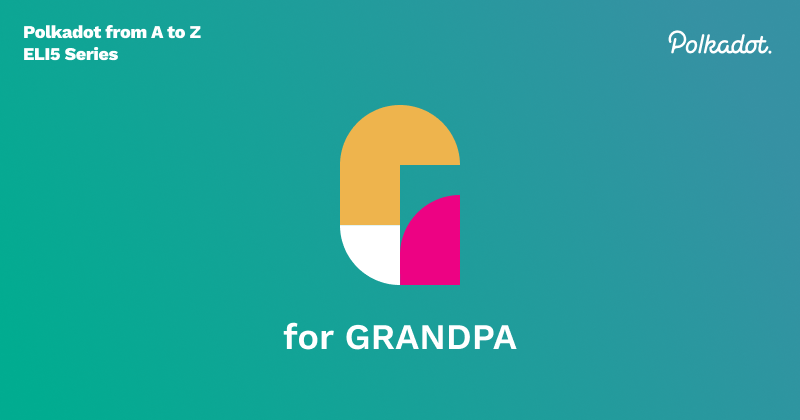

**GRANDPA**(GHOST-based Recursive ANcestor Deriving Prefix Agreement) is the finality module of the
Polkadot and Kusama blockchains.

## Finality

In the world of blockchains, finality is when a new block has been added to the blockchain with
confidence that it won’t be reverted, and the network agrees on this new copy of the chain. It
happens to be an essential part of the consensus mechanism. A consensus mechanism, such as Bitcoin's
Nakamoto consensus, has a probabilistic finality. The more blocks that get added after that block,
the higher the probability that the block will be included in the canonical (network-approved)
chain. However, this comes with risks - one can never be 100% sure that a block is canonical,
although the more blocks built on top of a given block, the less likely it is. Various kinds of
double-spend attacks rely on this feature, advertising a block that contains a transaction but does
not stay as a part of the canonical chain.

#### Let's think about this in a real-world scenario:

Let's say we’re buying a cup of coffee. The finality of that transaction is when the cash is handed
to the cafe, and the employee puts it in the register. Then, the cash value is recorded in the
cafe's books, stored in an envelope, and deposited at their bank; after a few days, it becomes
available in their account for payroll, rent, and other costs. During each of those steps, the
probability that cash value will be reverted, meaning lost or stolen, will become less and less
likely.

## GRANDPA

Polkadot and Kusama have a hybrid consensus model that splits the responsibilities of consensus into
two different modules: GRANDPA, the finality module, and BABE, the block production module. BABE
(Blind Assignment for Blockchain Extension) produces blocks, and GRANDPA decides which blocks are
finalized - that is, what is the provable canonical chain. Note that BABE has its own chain
selection rule, but it is probabilistic; however, if there is an issue with getting consensus from
the required number of validators for GRANDPA-derived functionality, the network reverts to
probabilistic finality as opposed to stalling.

Each round of GRANDPA votes can finalize many blocks on the canonical chain, significantly
increasing the speed of finalization. GRANDPA considers this sufficient for finality as long as ⅔ of
validators agree on the canonical chain. If there is a case of less than ⅔ consensus on a new copy
of the chain, GRANDPA has mechanisms to punish validators that vote on more than one new version of
the chain.

Splitting up consensus allows us to define network assumptions into the modules, making the
consensus model in Polkadot a **deterministic** model. Which we consider being more secure than a
probabilistic model. Especially since block production can continue and not stall even when not
enough validators are online, in this case, we fall back to the BABE chain selection. GRANDPA is a
piece of code that can be plugged into any blockchain; it's designed to work on any blockchain
implementation as the finality module as long as it is provided with the necessary inputs.

## Further reading

- GRANDPA paper: https://arxiv.org/pdf/2007.01560.pdf
- https://polkadot.network/polkadot-consensus-part-2-grandpa/
- https://medium.com/polkadot-network/grandpa-block-finality-in-polkadot-an-introduction-part-1-d08a24a021b5
- https://wiki.polkadot.network/docs/learn-consensus#what-is-grandpababe
