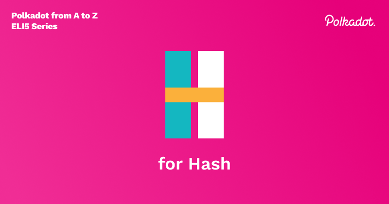

Hashing, in its simplest explanation, is a way to transform data. Depending on the underlying
hashing algorithm, the transformation of that data happens differently. For example, Bitcoin uses
the SHA-256 hashing algorithm (Simple Hashing Algorithm 2, 256bits), which returns a 256-bit output,
usually represented as an alphanumeric string. Even the slightest change in the input will
significantly modify the hashing algorithm’s output. In cryptography, this is known as
**diffusion**. For example, here, we will add whitespace to the end of the input.

    “Wow, such hash” = 9DD40341177F8ADD02DA4DE95A572D8BCBF8E07D51726FB51162442B13BB53D6

    “Wow, such hash ” = 8973F8EEA2536243DE4E67AEE2181E3D4C6470B1BA64E0C632E5C91EEDC47108

No matter the length of the input data, the hashing function will always return the same sized
output. It is a deterministic function, so it always produces the same output for the same input.
This output is helpful in many ways, such as quickly verifying and validating data sets of any size.

Hashes are a fundamental component of blockchain technology, and we use them in many parts. For
example, we can hash transactions and then query them by their hash. We can hash a collection of
transactions and create a transaction root hash; we can hash block data which include transactions
and metadata about the transactions, then use that output hash as the block's unique ID. In newer
generations of blockchains, we hash function calls and their outputs; we even hash new runtime
updates.

To understand blockchain, it is important to understand cryptographic hash functions. Well-designed
cryptographic hash functions will have the following properties:

### Properties of a Cryptographic Hash Function

**Deterministic**: The same input should always have the same output.

**Quick computation**: We need to ensure that the calculation of the function is fast.

**Preimage resistance(confusion)**: We need to be sure that the hashing output cannot be
reverse-engineered to find out what the original input was.

**A slight change in the input changes the output(diffusion)**: Even the slightest change in the
input should alter the output significantly.

**Collision-resistant**: We need to be sure that each unique input maps to an individual output.

**Second preimage resistance**: Given a hash function and its output, we should not be able to
generate an input (or inputs) that, when hashed, produce the same result.

### Hashing vs. Encryption

Hashing and encryption are related but different. **Hashing** is a one-way function, meaning that we
should not be able to reverse engineer the original input from just the output. **Encryption**, on
the other hand, is a two-way function. Data(plaintext) can be hidden(encrypted) by transforming it
to ciphertext with the encryption key. The ciphertext can then be transformed into the original
plaintext by decrypting the ciphertext with the decryption key. The encryption and decryption key
may be the same value or different, depending on the type of cryptosystem used.

### Hashing on Polkadot

Polkadot and Kusama use an implementation called **BLAKE2b**, based on the BLAKE2 cryptographic
hashing algorithm. BLAKE2 is also faster than SHA-2 and SHA-3, with similar or better security than
SHA-3. We chose BLAKE2 for its security, speed, and simplicity of implementation. The BLAKE2b
implementation is optimized for 64-bit platforms and can be twice as performant compared to running
the SHA-256 algorithm on a similar machine. Due to these advantages, the project ZCash transitioned
to using BLAKE2 hashing from SHA-256, projecting that BLAKE2 is improving over time while SHA-256 is
getting worse.

Blake2b hashing would look like the following:

    “Wow, such hash” =
    e530f3d3ddfc24213167e7c601733a1b688e6cf362277b46f1135e348aa63477

    “Wow, such hash ” =
    f299f5ee1731f755d0f58bdc54ef3b0cadb94f7f959c3b18627e12138ed5c70e
