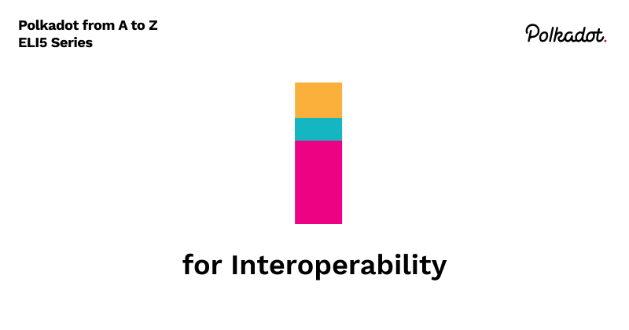

Interoperability is at the core of the Polkadot philosophy. We aspire to combat chain maximalism and believe that the ecosystem is healthier when blockchains can communicate with each other. That’s why we call ourselves a Layer 0 multi-chain platform, and with that comes the technical challenge of connecting isolated blockchain networks. In this post, I will explain what interoperability means, the difference between Layer 0 and Layer 1 chains, how we use cross-consensus messaging(XCM) to achieve cross-chain communication of arbitrary data, and what the different ways to connect to Polkadot.

## A little history: Interoperability of isolated internet networks

Starting in the early 70s up to the 80s, the internet began as isolated networks across universities, government agencies, and the military. Research fueled by these participants and an excited community of developers from around the globe led to the development of Transmission Control Protocol and Internet Protocol(TCP/IP), which allowed these isolated networks to connect, locate and interoperate with each other.
We can think of the current state of the blockchain ecosystem as the early days of the internet, a collection of isolated blockchains that still have yet to connect under a protocol that allows them to communicate with each other. Polkadot seeks to become that protocol that will allow blockchains to interoperate. That’s why we call it a Layer 0 blockchain/protocol.

## Layer 0 and Layer 1

From a societal development perspective, we scaled as communities into nation-states partly due to the specialization of skills. Members of the society can choose to develop their skills and specialize in areas like medicine, economics, politics, and manufacturing, among other things; they are also able to tap into an economy of trade where those specialized skills have a marketplace. We can think of those specializations as Layer 1 solutions: in the blockchain space, these are Bitcoin and Ethereum. And we can also think of the economy and marketplace as Layer 0. This is what Polkadot is aiming to be in the blockchain ecosystem. 

## XCM

Cross-Consensus Messaging (XCM) is a messaging format/paradigm that allows interoperability of Layer 1 blockchains. It is implemented at Layer 0 and has multiple message-passing functionalities. From Layer 1 to Layer 1, there is Cross-chain Message Passing(XCMP). From Layer 1 to Layer 0, i.e. from parachains to the relay chain, there is Upwards Message Passing (UMP), while from Layer 0 to Layer 1 (i.e. from the relay chain to parachains) we have Downwards Message Passing(DMP). [XCM](./terms/xcm) is un-opinionated about the structure of the chains on the sending and receiving end and can pass information unstructured to many types of chains. Hence, allowing any chain to utilize it for interoperability. We will cover this in more detail when we get to letter X.

## Interoperable chains: parathreads/parachains/bridges

Now that we understand the concept of Layer 0 and Layer 1, we can talk about the types of connections Layer 1 chains can have on Polkadot. 

**Parachain**: Parachains are Layer 1 solutions that will benefit from shared consensus and the pooled security of Polkadot. Parachain slots are slowly released by the network where potential parachain projects can place bids as parachain candidates. Most projects choose to do a crowdloan as a fundraising mechanism to increase their bid, hence their probability of winning a slot. Once a slot is won, the parachain project gets onboarded to Polkadot and is now a part of the ecosystem.

**Parathread**: All Parachains are, by default, Parathreads. Parathreads are under-the-hood parachain slots but allow multiple chains to reside in them, allowing chains to participate in consensus on a per-block basis. It might not make sense economically for some projects to live in a parachain slot full time; for those projects, we have parathreads. 

**Bridge**: Bridges are for established, economically sovereign chains with an already established network. There are still ways for those networks to connect to Polkadot and benefit from the economy. 