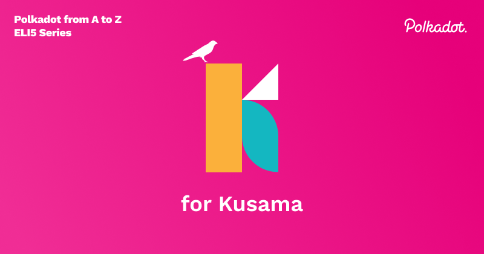

Kusama provides the same promises as Polkadot and behold, it comes with no promises! A heterogeneous multi-chain platform that uses a Nominated Proof of Stake(NPoS) consensus, with on-chain governance, and forkless runtime upgrades. It is known as the canary network for Polkadot and has been called a “value bearing test network” by Gavin Wood. At its core, Kusama is a blockchain network that shares an almost identical code base with Polkadot, with the caveat that it might be slightly more advanced since code gets tested first on Kusama and vetted before moving onto Polkadot(but not always); the slight differences in parameters make it a good testing ground, but also a great place for startups and teams that want to move fast. For example, [this](https://polkadot.network/blog/grandpa-equivocation-and-sysinfo-process-collection-results-in-slashing-on-kusama-network-a-post-mortem/) postmortem of when a slashing bug was found on Kusama and fixed before it could impact Polkadot. As the slogan goes “Expect Chaos”. The Kusama community tends to be a bit more developer focused, and smaller than Polkadots. And even though it started as a value bearing test network, we are now seeing projects that will only deploy on Kusama with no plans to deploy to Polkadot, so we are seeing Kusama become its own fully fledged network in its own right.

## Some functionality differences between Kusama and Polkadot

There are runtime differences that make Kusama more conducive to testing out features. In general Kusama is 4x as fast as Polkadot. This allows for an environment where runtime changes and parachain features can be tested “quicker”. Not everything is 4x as fast, for instance the block time and speed of which the chain grows is the same, at 6 seconds per block. Some of the main differences:

<table>
  <tr>
   <td><strong>Parameter</strong>
   </td>
   <td><strong>Polkadot</strong>
   </td>
   <td><strong>Kusama</strong>
   </td>
  </tr>
  <tr>
   <td><a href="https://wiki.polkadot.network/docs/build-protocol-info#existential-deposit">Existential Deposit</a>
   </td>
   <td>1 DOT
   </td>
   <td>33.3333 microKSM (0.0000333333 KSM)
   </td>
  </tr>
  <tr>
   <td><a href="https://wiki.polkadot.network/docs/glossary#epoch">Epoch</a>
   </td>
   <td>4 hours
   </td>
   <td>1 hour
   </td>
  </tr>
  <tr>
   <td><a href="https://wiki.polkadot.network/docs/glossary#era">Era</a>
   </td>
   <td>24 hours
   </td>
   <td>6 hours
   </td>
  </tr>
  <tr>
   <td><strong><a href="https://wiki.polkadot.network/docs/maintain-guides-democracy">Democracy</a></strong>
   </td>
   <td>
   </td>
   <td>
   </td>
  </tr>
  <tr>
   <td>Voting Period
   </td>
   <td>28 days
   </td>
   <td>7 days
   </td>
  </tr>
  <tr>
   <td>Launch Period
   </td>
   <td>28 days
   </td>
   <td>7 days
   </td>
  </tr>
  <tr>
   <td>Enactment Period
   </td>
   <td>28 days
   </td>
   <td>8 days
   </td>
  </tr>
  <tr>
   <td><strong><a href="https://wiki.polkadot.network/docs/learn-staking">Staking</a></strong>
   </td>
   <td>
   </td>
   <td>
   </td>
  </tr>
  <tr>
   <td>Term duration
   </td>
   <td>1 day
   </td>
   <td>6 hours
   </td>
  </tr>
  <tr>
   <td>Nomination period
   </td>
   <td>1 day
   </td>
   <td>6 hours
   </td>
  </tr>
  <tr>
   <td>Un-bonding duration
   </td>
   <td>28 days
   </td>
   <td>7 days
   </td>
  </tr>
  <tr>
   <td><strong><a href="https://wiki.polkadot.network/docs/learn-parachains">Parachains</a></strong>
   </td>
   <td>
   </td>
   <td>
   </td>
  </tr>
  <tr>
   <td>Max lease period
   </td>
   <td>2 years
   </td>
   <td>1 year
   </td>
  </tr>
</table>

The 4x faster environment allows for more experimentation, such as the ability to pass new runtime upgrades quicker, this requires diligence from the participants to stay up to date. When it comes to parachain slots, the team at Parity has suggested that the Kusama to Polkadot ratio will be 4:3, meaning Polkadot should have 75% parachain slot capacity as Kusama in order to ensure stability guarantees.

## Testing in the world of blockchains

The main reason we need Kusama is that Web 3.0 functionality has high stakes due to blockchains' monetary aspect. It is important to note that testing features of blockchain networks is not as straightforward as features of Web 2.0 applications. Failed features of blockchain technologies can lead to large financial losses. The Ethereum DAO [story](https://news.coinsquare.com/blockchain/the-dao-how-a-failed-project-may-still-impact-the-world/) is a perfect example, where a smart contract was drained of $150 million worth of ETH. In Web 2.0 applications, testing a feature can be as easy as putting it on a test server where it can be confirmed to work, before it is released into production. This effort can take anywhere between a couple minutes to a day or two, depending on the size of the feature. Blockchains however, have a few aspects that make testing more difficult. Blockchains are heavily game theoretic; the behavior of participants are incentivized through value bearing tokens(cryptocurrencies). If for some reason a runtime upgrade contains some gameable bug, this can be difficult to foresee, and could take the malicious participant a while to find. Hence to really test changes to code, we need a network where real value is being used, and there we can find such errors. Kusama acts as that value bearing network, so that when a piece of functionality is tested and the code is audited, we can be more certain of its validity before putting it on Polkadot.

## Kusama as of now, and becoming its own network

It is interesting to see that the canary paradigm of Kusama also reflects in the parachains deployed on it. Projects in the Polkadot ecosystem tend to test their functionalities on their respective Kusama parachain first and then plan to deploy them on their Polkadot parachain, however we are slowly seeing projects that do not have plans to deploy their projects to Polkadot and only stay on Kusama.** **Both chains are running smoothly and are onboarding more parachains as we speak. As of now, Kusama has 16+1 and Polkadot has 5+1, the +1 being Statemine and Statemint respectively, the common-good parachains deployed and maintained by the team at Parity. To learn more about Kusama checkout the [guide](https://guide.kusama.network/) and check out all the parachains on Kusama [here](https://parachains.info/#!). Kusama has funded 72,590KSM to proposals through its Treasury so far, including a few chain state scanners like Subscan and Polkascan, as well as wallets like Fearless and Polkawallet. Checkout all the Treasury activity on Kusama [here](https://www.dotreasury.com/ksm/).