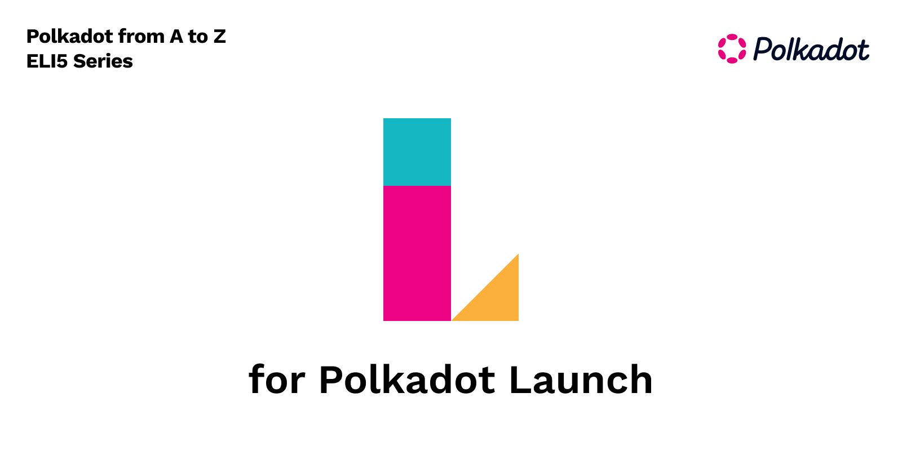

At the end of 2021 Polkadot hit an important checkpoint with the rollout of parachains, marking the final phase of the original promise of the whitepaper that was published in 2016. The Genesis block time stamped on May 26 2020 at 15:36:21 UTC marked the first phase of Polkadot’s launch. A planned, phased and controlled transition process from a centralised and closely controlled network, into a decentralized network started. 5+ years have passed since the original whitepaper, and in this post I’d like to explain the phases the network went through and the reasoning behind them, as well as peek into the future. The path is still being traversed, and we have a long road ahead, so let's dive into the details:

**Phases (2016 - 2022)**

**Proof of Authority (PoA) [May 26, 2020]**

The Polkadot network started as a Proof of Authority network which is a consensus mechanism that gives a small number of validators full control over the network. It was maintained by 6 validators that were controlled by Web3 Foundation. With the power of Sudo (a Substrate functionality that allows for a single account to do anything to the chain using root, though a bit technical you can learn more about it [here](https://docs.substrate.io/rustdocs/latest/pallet_sudo/index.html) and [here](https://www.shawntabrizi.com/substrate/the-sudo-story-in-substrate/)), the Foundation closely nourished the early stages of the network. Users were allowed  to claim their DOT tokens and stake them. However, during this phase, users' staking only meant **signalling their intention** to be a validator or nominator. The Foundation used this as a metric to know when there were enough validators to remove some control over the network and into the hands of the DOT holders.

**Nominated Proof of Stake (NPoS) [June 18, 2020]**

Once there was enough signal from intended validators, it was time to start the next phase. This would entail a transition of the network from PoA to NPoS. The Foundation did this by using a Sudo call to change the [Eras](https://support.polkadot.network/support/solutions/articles/65000168050-what-is-an-era-), which triggered the first validator election. This phase marked the first efforts to decentralize the network further. Also during this phase, Sudo was used to slowly increase the active validator set.

**Governance and Sudo removal [July 20, 2020]**

[Governance](https://wiki.polkadot.network/docs/learn-governance) on Polkadot is how runtime upgrades are enacted by the DOT token holders. The only way to remove Sudo from the control of the Foundation was through referendums which the DOT token holders could participate in. This would be done by the Foundation enabling Governance (using Sudo of course) in which the network can start electing Council and Technical Committee members and start accepting public proposals. With Governance in place, Sudo was removed through public referenda and the root power was transferred over to the DOT holders.

**Balance Transfers [August 18, 2020]**

With Sudo removed, anything here on out required Governance to enable runtime upgrades. Balance transfers were enabled on block number 1,205,128 by the DOT token holders through a public proposal. With this runtime upgrade in place, DOT holders could now transfer funds between accounts.

<!-- 
>>>>>  gd2md-html alert: inline image link here (to images/image1.png). Store image on your image server and adjust path/filename/extension if necessary.  (<a href="#">Back to top</a>)(<a href="#gdcalert2">Next alert</a>) >>>>> 

 -->

**Parachain Rollout [October 13, 2021]**

With over a year of development efforts, parachain functionality was first tested on the Rococo test network and then released via governance on Kusama before being announced during the Sub0 conference that parachain functionality was ready for Polkadot in October of 2021. With [Motion 118](https://polkadot.polkassembly.io/motion/118), proposing 2 batches of auctions parachains on Polkadot were on the way. The DOT community voted to pass this motion and auctions were set to start on November 11, 2021 and the first 5 parachains (Acala, Moonbeam, Parallel Finance, Astar, and Clover) were onboarded December 18, 2021. Currently(January, 14 2022) the 2nd batch of auctions are well on their way, with the 2nd batch due to get onboarded on or around March 11, 2022. 

**Future [2022 - infinity]**

As the rollout suggests, an important goal is making Polkadot as decentralized as possible. One suggested next step in this direction is to remove the Council as well as the Technical Committee as they’re both points of centralization, and [a new governance model is being developed](https://github.com/paritytech/substrate/pull/10195) that does exactly that. In addition to that endeavour, there are several proposals for the next stages of the network, and Robert Habermeier recently talked about some [upcoming efforts](https://www.youtube.com/watch?v=z5i7TVEyn-Y). These include async backing, a way to build and bundle validated parachain blocks before writing them to the Relay Chain, parathreads, and especially, a way to schedule parachain slot availability on a block-by-block basis. Some network optimizations have also been proposed, with a focus on improving collator and validator interactions.