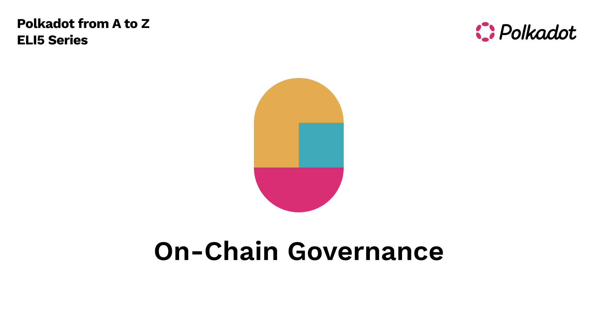

To understand on-chain governance we need to understand the origin entities, the components in the cycle, and how they work together.

**Council**

The council is an on-chain origin whose purpose is to represent passive token holders. Though it is a central group of authority, candidates need to be elected into the council by token holders. So gaining favorability among the community is imperative in order to win a council seat. Council members have a few key responsibilities; **initiating sensible referenda, canceling uncontroversial, harmful and malicious referenda, managing the treasury and electing members to the technical committee**. Currently on Polkadot there are 13 council seats, with space for up to 20 runners-up(those waiting to become council members). And on Kusama there are 19 seats, with space for up to 19 runners-up. The council rotates (councilors get re-elected) every 7 days on Polkadot and every 24 hrs on Kusama. 

**Technical Committee**

The Technical Committee is a group of teams that have proven their technical knowledge by successfully implementing a Polkadot runtime. Teams can be added or removed by simple majority votes in the Council. 

Purpose of the Technical Committee is to **safeguard against malicious referenda, implement bug fixes, reverse faulty runtime updates, or add new but battle tested features.** These changes through the technical committee are fast-tracked for voting and implementation.

**Proposals**

There can be two types of proposals on-chain. **Public proposals**, which are made by token holders. And **Council proposals**, which come in the form of external motions, either made by a Council member, or a token holder. Council also has a special internal motion, but these do not become referendums. Internal motions don’t require Democracy pallet functionality, as in they handle matters which don’t require runtime changes, such as handling treasury proposals, or electing technical committee members. Public proposals can be made by bonding the minimum amount of tokens (currently 100 DOT on Polkadot), and once the proposal has been posted on-chain, token holders signal their support by _endorsing _it. Endorsing requires them to bond the same amount of tokens as the account that originally posted the proposal. Amount bonded is the critical metric when choosing which proposals become referendums. A proposal with 3 accounts bonding 10 DOTs each outweighs 29 accounts bonding 1 DOT each. The bonded tokens will be released back to the original accounts when the proposal becomes a referendum.

**Referenda**

Council proposals will become referendums when a simple majority of council members agree on the proposal. This is how the council can initiate legislation. Once passed, it becomes a public referendum. And if the proposal was created by token holders, those which have the highest amount of bonded tokens backing them become public referendums. 

Each proposal type, public and council, have their own on-chain queue. Proposals live in their respective queues, and every 28 days (on Polkadot) the most backed proposal will become referendums that can be voted on. The on-chain mechanism that chooses the next proposal to become referendums alternates between the public and council queue.

The timetable for referendums on Polkadot is every 28 days. Meaning that every 28 days the most backed public proposal or the most recent council proposal becomes a referendum and will be up for vote by the token holders. Unless there is an emergency referendum on the table, there can only be one referendum up for vote at a time. By alternating queues every 28 days, assuming both queues are full with a bunch of proposals, each respective queue will get their turn every 56 days. Active referenda can be viewed using chain explorers, such as [Polkadot JS UI](http://polkadot.js.org), or [Polkasembly](https://polkadot.polkassembly.io/). 

**Voting**

Token holders can choose from multiple levels of support for a referendum, anywhere from **not bonding any tokens **which reduce their votes weight or by **bonding up tokens **for a range of time periods to increase their voting power. This creates an incentive to dissuade vote selling, and also a way to allow smaller token holders to increase their voting power by locking up tokens for more than the minimum required amount. This is called conviction voting. Based on the voting outcome, the referendum will either pass or fail. If it passes, then it will be enacted, meaning the runtime upgrade will be included in an upcoming block.

**Conviction Voting**

Simply put, conviction voting, aka voluntary locking, is a mechanism that allows token holders to increase their voting power on referenda by locking up their tokens securely on-chain. Built-in multipliers have a minimum of 0.1x (meaning no bond) and a maximum of 6x (bonded for 896 days). Remember, a single lock up period is equal to the timetable of a referendum, which is 28 days.

<table>
  <tr>
   <td>Lock up period(amount in eras)
   </td>
   <td>Multiplier
   </td>
  </tr>
  <tr>
   <td>0
   </td>
   <td>0.1
   </td>
  </tr>
  <tr>
   <td>1
   </td>
   <td>1
   </td>
  </tr>
  <tr>
   <td>2
   </td>
   <td>2
   </td>
  </tr>
  <tr>
   <td>4
   </td>
   <td>3
   </td>
  </tr>
  <tr>
   <td>8
   </td>
   <td>4
   </td>
  </tr>
  <tr>
   <td>16
   </td>
   <td>5
   </td>
  </tr>
  <tr>
   <td>32
   </td>
   <td>6
   </td>
  </tr>
</table>

And the equation used to calculate your voting power is:

`votes = tokens * conviction_multiplier`

Meaning, that if you don’t lock up your tokens, your vote will be worth 1/10th of a regular vote. If you lock up for 1 voting period, by bonding the same amount as the originator of the proposal your vote will be worth 1 vote, and if you lock up for 32 periods, your vote will be worth 6x. 

Conviction voting is there to help protect and keep a check and balance for smaller token holders, by giving them the ability to increase their voting power.

**Adaptive Quorum Biasing (Turnout Biasing)**

We can think of this mechanism as a lever that changes the super-majority percentage needed for referenda to pass. Its importance lies in situations where there is no clear majority backing or against a referendum. Voting turnout will cause this mechanism to fall into two categories,** positive turnout bias **and** negative turnout bias**, which control the **simple majority **variable.

All public proposals use what is called **positive turnout bias**, meaning that as the referendum turnout increases, the threshold of “aye” votes needed decreases. Positive turnout bias ensures that with lower turnout, only uncontroversial proposals can pass. For example if turnout is 25%, which is a low turnout, the super-majority needed is around 66%. As turnout increases, the super-majority needed decreases. For example, if turnout is 75% then the super-majority needed will be 54%.

Council proposals which pass unanimously use **negative turnout bias**, meaning it is easier to pass with low turnout and requires the super-majority to deny it. 

**Canceling**

There are a few cancelation methods which can be utilized at different points of a proposal's lifespan:

1. If there is a unanimous agreement, the Technical Committee can cancel a proposal.
2. If the proposal has become a referendum, and there was a last minute issue such as a bug in the runtime code. The Council, through a 2/3rds majority vote, can cancel the referendum.

A canceled proposal’s deposit will be burned, but in the past there have been proposals to reverse the burned tokens if it was controversial.

**The future (On-chain Governance 2.0)**

Though not perfect, the current model has worked well for the past 2 years. Ever since the first proposals, there were already thoughts floating around as to how some weaknesses could be improved in the future. The community has signaled concern about the low voter turnout, and council and technical committee being a central form of authority.

In efforts to address these issues, and decentralize the Polkadot and Kusama networks even further, efforts to dissolve the council and technical committee have been a focus of the development team at Parity Technologies. [The code that would make this possible has been merged into the Substrate code base](https://github.com/paritytech/substrate/pull/10195), but has yet to be tested on Kusama, audited and approved by the community via runtime upgrade. The goal of governance 2.0 is to be a more agile, inclusive, secure and decentralized design.

If you would like to learn more about on-chain governance check out some of these resources:

* [Blog post about governance 1.0](https://polkadot.network/blog/polkadot-governance/)
* [Polkadot Wiki: Governance](https://wiki.polkadot.network/docs/learn-governance)