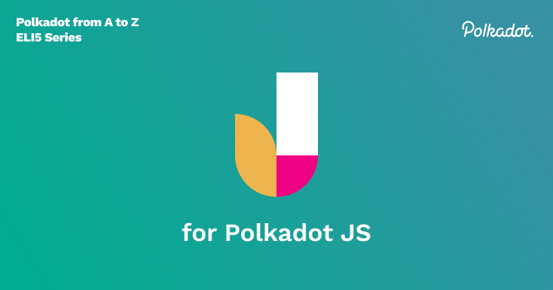

Polkadot.js is a collection of tools that interfaces with the Polkadot blockchain in very granular ways. Polkadot.js as a term has multiple moving parts that are worth mentioning:

1. **[Polkadot.js UI](https://polkadot.js.org/)**
    1. This is the hosted application that loads when you navigate to in your browser and click apps wallet(hosted). This is also sometimes called “Polkadot-JS App”.
2. **[Polkadot.js API](https://github.com/polkadot-js/api)**
    2. This is the JavaScript API, a reusable library to allow programs to interface with the functionality of Polkadot. 
3. **[Polkadot.js Extension](https://polkadot.js.org/extension/)**
    3. This is the Chrome extension that allows you to manage your accounts and sign transactions. Note that all that it does is sign messages; it has limited functionality compared to full-featured wallets, and cannot connect to the Polkadot network itself.
4. **[Polkadot.js codebase](https://github.com/polkadot-js/)**
    4. The codebase contains all the repositories of code that are required to have the suite of tools working. You can navigate to the codebase here.
5. **[Polkadot.js Phishing List](https://polkadot.js.org/phishing/)**
    5. The Phishing List website is a community driven curation of a list of less-than-honest operators. This list of URLs and addresses are constantly updated and the polkdot.js extension uses it as a source to warn you when you navigate to a URL included in the list and blocks the addresses from the apps UI. Users can also contribute suspicious sites and addresses if they come across them.

## Polkadot JS UI

In this post I will focus on the UI, a powerful web application that has granular functionality support when it comes to interacting with the Polkadot blockchain. It is not considered to be just a wallet, it has more abilities than just creating accounts or sending and receiving transactions. 

## Abilities

Among other things, it also allows us to:

1. Participate in staking
2. Take part in governance
3. Contribute to parachain crowdloans 
4. Run Parachain auctions
5. Query chain metadata
6. Query on-chain data using RPC calls

Essentially, it allows you to perform all functionality that a  user can do on either the relay chain, or any parachain (although the user interface may not be aligned exactly with the functionality of any individual parachain). Thanks to [Jaco](https://www.parity.io/blog/people-of-parity-jaco-greeff/) from Parity, it has been keeping up with the developments of the Polkadot runtime which is implemented in Rust. As a developer if you’re building a Substrate based blockchain, you can utilise the Polkadot.js UI to test your code's functionality.

All in all, interacting with the Polkadot JS UI comes down to either querying on-chain data, or issuing an extrinsic. Let's talk about what that means exactly.

## Querying on-chain data

In order to populate the UI, the web application queries the Polkadot.js API. The API then queries a Polkadot node, and uses JavaScript to return information that the UI will display on the screen. You can choose which node to connect to by changing it in the upper-left hand corner of the screen.

## Issuing an extrinsic

Extrinsics are pieces of information that come from outside the chain and are included in a block. Extrinsics can be one of three types: **inherents**, **signed** and **unsigned transactions**. Most extrinsics made from the Polkadot JS UI will be signed transactions. **Inherits** are non-signed and non-gossiped pieces of information included in blocks by the block author, such as timestamps, which are “true” because a sufficient number of validators have agreed about validity. **Unsigned transactions** are information that do not require a signature but will require some sort of spam prevention. **Signed transactions** are issued by the originator account of a transaction which contains a signature of that account, which will be subject to a fee to have it included on the chain. 

## Considerations

There have been concerns raised  by the community about the complexity of Polkadot-JS UI . However the aim of Polkadot.js UI is to support as much functionality that the relay chain requires of its users. Everytime there is a runtime update(which can be quite often) there is a potential change that needs to be made on the Polkadot.js codebase. For example, with most 3rd party wallets, when there are runtime updates they will usually need to add support for it. Polkadot.js UI is not focused as much on a user-friendly UI, but rather to support the Polkadot runtime without any bugs. 

For more user-friendly but simpler wallet implementations, check out the wiki page where we list [Parity-developed and Treasury funded wallet projects](https://wiki.polkadot.network/docs/build-wallets#treasury-funded-wallets)

Take a look at some of the educational content we have created to learn more about Polkadot.js

[Introduction to Polkadot.js](https://www.youtube.com/watch?v=4EQqwGFV1D8)

[Create an account using Polkadot.js](https://www.youtube.com/watch?v=sy7lvAqyzkY) 

