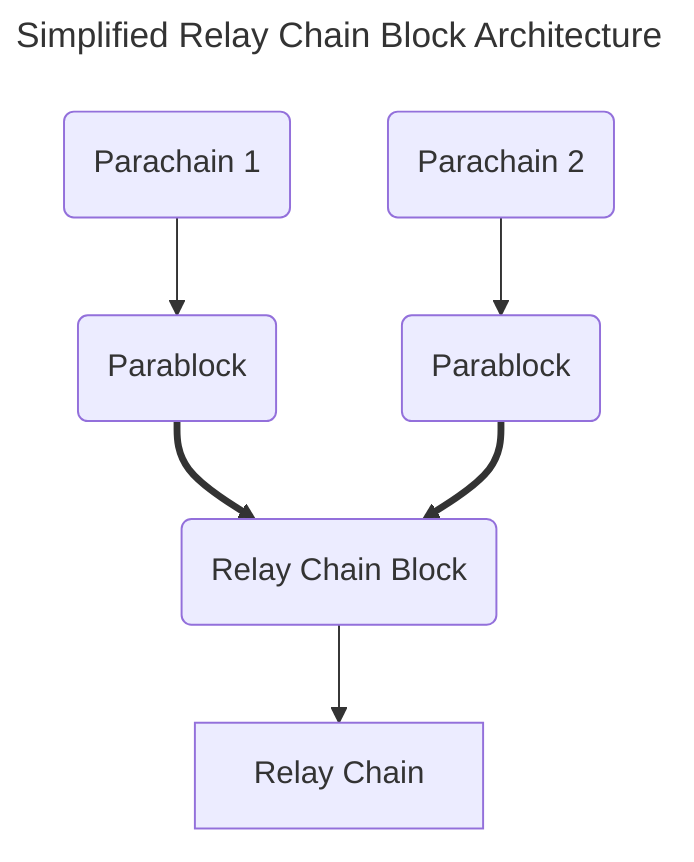

Before diving into development, some standard terminology and components will be persistent throughout this guide.  Often, these components work together to achieve the scalability and interoperability that Polkadot provides. 

:::info When in doubt, read the wiki!

For more in-depth explanations, be sure to check out the [Polkadot Wiki](https://wiki.polkadot.network/docs/learn-architecture-index), which covers specifics on how Polkadot works at multiple levels.

:::

## Building "Blocks"

Before elaborating on the network components of a network like Polkadot, the following is essential to realize as they will be assumed knowledge throughout the guide: 

- Blocks, in the most basic sense, are simply bundles of state transitions.  Each transaction, or extrinsic, is a state transition.
- When we refer to **blocks**, this usually refers to the **relay chain's** concept of a block.
- Blocks on the relay chain represent the state of all the subsequent parachains. 
- **Parablocks** are blocks from the parachain to the relay chain.  Parablocks carry state transitions from their respective parachain.

:::info Receipts, not blocks!

In most blockchain systems, when we refer to blocks being stored, it almost **always** meaning that the **header** (or some other representation) of the block is stored.  Doing so would cause a lot of on-chain bloats, especially considering the state of other parachains, where each parachain may have varying amounts of data per block.

The same goes for parablocks - it's the [**candidate receipt**](https://wiki.polkadot.network/docs/learn-parachains-protocol#candidate-receipts) being stored within the relay chain block, not the actual state transition itself.  A **candidate receipt** is the summary of the exchange of information that occurs between the parachain and relay chain.

:::

## Relay Chains & Parachains

**Relay chains** are networks that provide validation and economic security to parachains.  They are called "Layer 0" in the stack, containing the core functionality to host parachains.  Typically, the relay chain itself is kept to a few core responsibilities, one containing the logic for validating its parachains.

Relay chains can also be thought of as [**blockspace**](https://wiki.polkadot.network/docs/glossary#blockspace) allocators, where parachains pay for the secure blockspace that relay chains inherently provide as a result of their economic security.

:::info Relay Chains and Sharding

You will often hear Polkadot described as a "sharded" blockchain network, which enables scalability in an otherwise resource-constrained environment.

The primary idea behind having a series of parachains is to introduce the notion of **sharding**.  Each parachain can run its unique application-specific state transition function (also called a **runtime**).  Parachains can now work in parallel to one another, focusing on their specific application while still being finalized by the relay chain's validator set.

:::

**Parachains** are also full-fledged blockchains, but unlike a **solo chain**, they can interoperate with other parachains on the relay chain.  Parachains have the advantage of the relay chain finalizing and validating their state transitions - meaning the relay chain represents the state of all of its parachains on the network.

Polkadot is a relay chain that contains functionality for balances, staking, governance, and this validation logic for hosting parachains.  

## Validators

As with any proof of stake network, such as Polkadot, [validators](https://wiki.polkadot.network/docs/learn-validator) are needed to validate state transitions on the network.  When validators are referenced, it usually refers to the **relay chain's** validators.

### Paravalidators

[Paravalidators](https://wiki.polkadot.network/docs/learn-validator#para-validators) is a *subset* of the relay chain's validators selected to validate a particular parachain.  Using a PoV (Proof of Validity) function, each block candidate becomes backable via parachain validators (paravalidators).  After a block is considered backable, it is only later that the wider validator set provides a series of secondary checks and includes finalized blocks on the chain.
 
## Collators

[Collators](https://wiki.polkadot.network/docs/learn-collator) are full nodes that pass state in the form of **block candidates** from the **parachain** to **relay chain**.  Collators play the role of a validator for a parachain, except no security guarantees are needed.  Only one honest collator is needed to ensure proposed state transitions from the parachain are sent to the relay chain.
