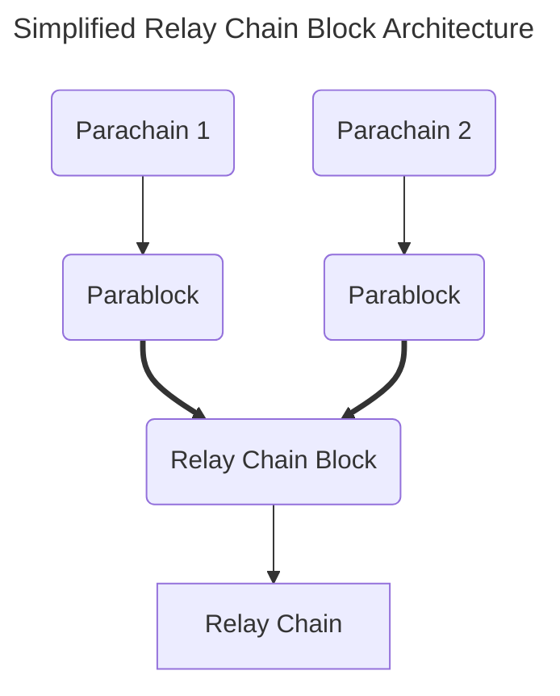

Before diving into development, there is some common nomenclature and components that will be persistent throughout this guide.  Oftentimes, these components work together to achieve the scalability and interoperability that Polkadot provides. 

## Building "Blocks"

Before elaborating on the network components of a network like Polkadot, the following is important to realize the following as they will be assumed knowledge throughout the guide: 

- Blocks, in the most pure definition, is simply a bundle of state transitions.  Each transaction, or extrinsic, is a state transition.
- When we refer to "blocks", this usually refers to the **relay chain**. 
- Blocks on the relay chain represent the state of all the subsequent parachains. 
- **Parablocks** are blocks coming from the parachain to the relay chain. Parablocks carry state transitions from their respective parachain.

## Relay Chains & Parachains

**Relay chains** are networks that provide validation and economic security to parachains. They are referred to as "Layer 0" in the stack, as they contain the core functionality needed to host parachains.  Typically, the relay chain itself is kept to a few core reponsbilities, one of which is containing the logic for validating its parachains.

Relay chains can also be thought of as **blockspace** allocators, where parachains pay for the secure blockspace that relay chains inherently provide as a result of their economic security.

:::info Relay Chains - Blockchain Sharding?

The primary idea behind having a series of parachains is to introduce the notion of **sharding**.  Each parachain can run its own, unique application specific state transition function (also referred to as a **runtime**).  Parachains can now work in parallel to one another, focusing on their specific application, whilst still being finalized by the relay chain's validator set.

:::

**Parachains** are also full-fledged blockchains, but unlike a **solo chain**, they are able to interoperate with other parachains on the relay chain.  Parachains have the advantage of the relay chain finalizing and validating their state transitions - meaning the relay chain represents the state of all of its parachains on the network.

Polkadot is a relay chain that contains functionality for balances, staking, governance, and this validation logic for hosting parachains.  

## Validators

As with any proof of stake network, such as Polkadot, validators are needed to validate state transitions on the network.  When validators are referenced, it usually refers to the **relay chain's** validators.

### Paravalidators

Paravalidators are a *subset* of the relay chain's validators selected to valdiate a particular parachain.  Using a PoV (Proof of Validity) function, each block candidate becomes backable via parachain validators (paravalidators).  It is only later, after a block is considered backable, that the wider validator set provides a series of secondary checks and includes finalized blocks on the chain.
 
## Collators

Collators are full nodes that pass state in the form of **block candidates** from the **parachain** to **relay chain**.  Collators play the role of a validator for a parachain, except no security guarantees are needed.  Only one honest collator is needed to ensure proposed state transitions from the parachain are sent to the relay chain.
