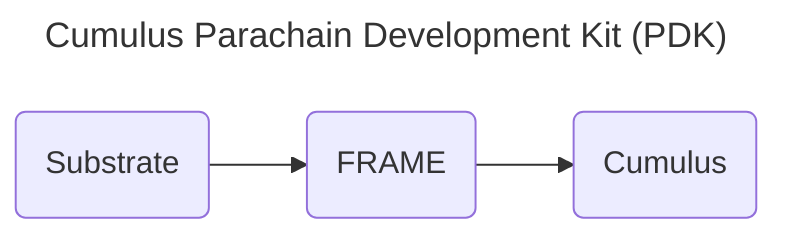

Recall that parachains are shards in the relay chain network.  A relay chain without parachains is not terribly useful from a user's perspective, as parachains provide application-specific runtimes that can work in parallel.  

## Examples of Existing Parachains

There are many existing parachains on both Polkadot and Kusama, all of which harness the relay chain's validation schemes to faciliate their application-specific parachains: 

- Acala - Liquid Staking Platform
- Moonbeam - Smart Contract and Interoperbility Platform
- Astar - Cross Chain Smart Contract Platform

## Cumulus - Parachain Development Kit (PDK)

The chains mentioned above use **Cumulus** to build their parachain.  Cumulus is a parachain development kit that uses Substrate and FRAME to make building parachains a streamlined process for a developer.

More notably, besides providing the necessary tools for building a Substrate runtime, Cumulus provides functions needed for connecting to and validating blocks from collators to the relay chain.

### Relation to Substrate & FRAME

Although this diagram is simplified, this is essentially the relationship between these tools.  For more information refer to the documentation for [Substrate](https://paritytech.github.io/substrate/master/substrate/index.html), FRAME, and Cumulus.

For a more [detailed diagram](https://paritytech.github.io/substrate/master/substrate/substrate_diagram/index.html), refer to the official Substrate documentation.