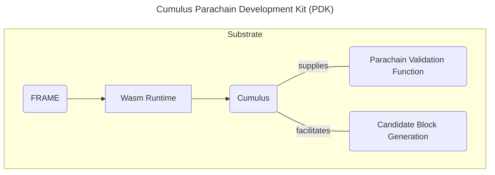

Recall that parachains are shards in the relay chain network.  Each parachain defines a runtime, or state transition function, specific to their parachain.  A relay chain without parachains is not helpful from a user's perspective, as parachains provide application-specific platforms that can work in parallel.  

## Examples of Existing Parachains

Many existing parachains on Polkadot and Kusama all of which harness the relay chain's validation schemes to facilitate their application-specific parachains.  Some are **system** parachains, which fulfill some specific functionality for the ecosystem.  Below are examples of these [system parachains](https://wiki.polkadot.network/docs/learn-system-chains): 

- [Asset Hub](https://wiki.polkadot.network/docs/learn-system-chains#asset-hub) - a generic assets parachain that provides functionality for deploying and transferring assets — both Fungible and Non-Fungible Tokens (NFTs).
- [Bridge Hub](https://wiki.polkadot.network/docs/learn-system-chains#bridge-hubs) - a parachain that contains the logic needed for bridging to other relay chains or ecosystems.
- [Collectives](https://wiki.polkadot.network/docs/learn-system-chains#collectives) - The Collectives chain hosts on-chain collectives that serve the Polkadot network.  These on-chain collectives will play essential roles in the future of network stewardship and decentralized governance.

## Cumulus - Parachain Development Kit (PDK)

The chains mentioned above use [**Cumulus**](https://github.com/paritytech/cumulus/blob/master/docs/overview.md) to build their parachains.  Cumulus is a parachain development kit that uses Substrate and FRAME to make building parachains a streamlined process for a developer.

More notably, besides providing the necessary tools for building a Substrate runtime, Cumulus provides the means to fulfill the requirements for validating blocks supplied from collators to the relay chain.

### Relation to Substrate & FRAME

Although this diagram is simplified, this is essentially the relationship between these tools.  For more information, refer to the documentation for [Substrate](https://paritytech.github.io/substrate/master/substrate/index.html), FRAME, and Cumulus.

For a more [detailed diagram](https://paritytech.github.io/substrate/master/substrate/substrate_diagram/index.html), refer to the official Substrate documentation.
