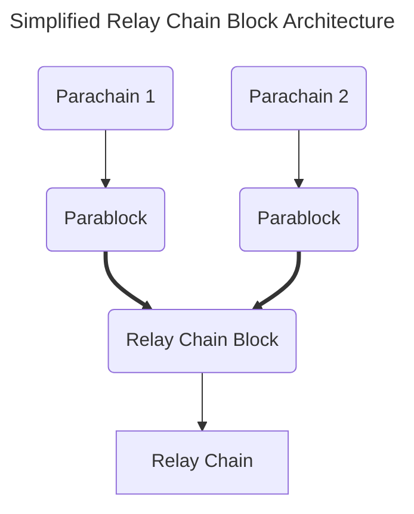
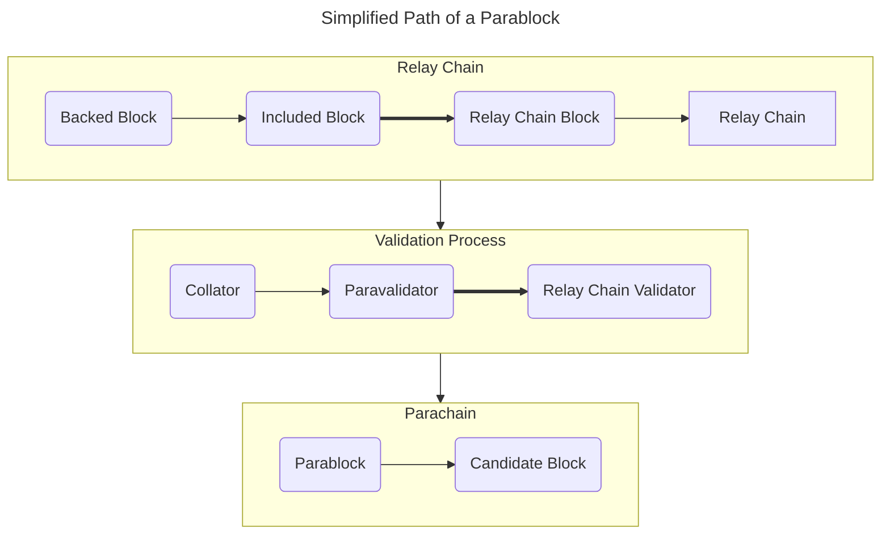

The relay chain relieves the parachain of economic security's responsibility while facilitating interoperability.  Several stages are involved, from the collator, paravalidators, and the wider relay chain's validator set.

## The Path of a Parablock

If you recall the diagram from Network Components, you will notice a simplified path that the parablock travels to be included in the relay chain:

However, a more involved process enables parablocks to be validated and included on the relay chain.

:::info State transition?  Transaction?  Extrinsic?  What's the difference?

Until now, the term **state transition** has been repeated a few times.   A state transition merely represents some State A moving to some State B, which the blockchain must validate as honest and abiding or reject due to invalidity.

:::

At a high level, the path of the parablock must undergo several stages before it is to be included and finalized on the relay chain.  

Here is a brief breakdown of how a parablock may move from parachain to relay chain:

- A subset of paravalidators is selected on the relay chain to validate a particular parachain.
- The parachain's collator passes the potential parablock, with a proof of validity, to the paravalidators.
- The collator also passes the PVF, or **parachain validation function**, to the paravalidators.  The PVF validates that the transitions in the parablock are valid.
- A paravalidator seconds this block, which is was a candidate block, and is also validated by other paravalidators.
- This block is now **backable**, and can now be considered as **backed**.
- The backed block can now be selected by the wider set of relay chain validators.
- After a second series of checks, the relay chain's validators include the block.

For a more thorough explanation, refer to the ["The Path of a Parachain Block" by Joe Petrowski](https://polkadot.network/blog/the-path-of-a-parachain-block) and the [Polkadot Wiki](https://wiki.polkadot.network/docs/learn-parachains-protocol).

## Requirements for a Parachain

In the list above, note the terms: **Parachain Validation Functio**n and **Proof of Validity**.  These both are requirements needed for the parachain to communicate with the relay chain:

- The proof of validity is an amount of witness data sent with a potential parablock, which may include affected points of a merkle tree, the list of state transitions, and the hashes that the state transitions modified within the parachain's storage.  This data is what helps verify the overall validity of the block throughout the entire process.

- A Parachain Validation Function, or **PVF**, is essentially the Wasm runtime of a parachain.  It defines how the state is supposed to transition for that certain parachain.  The entire state of the parachain doesn't need to be verified - just the proposed state changes for that particular parablock.

In the section page, we also discussed Cumulus, a Parachain Development Kit based on FRAME and Substrate.  Cumulus provides the functions needed for collators to provide the PVF and information for the proof of validity to be generated, which is required for the parachain to finalize its state on the relay chain.
