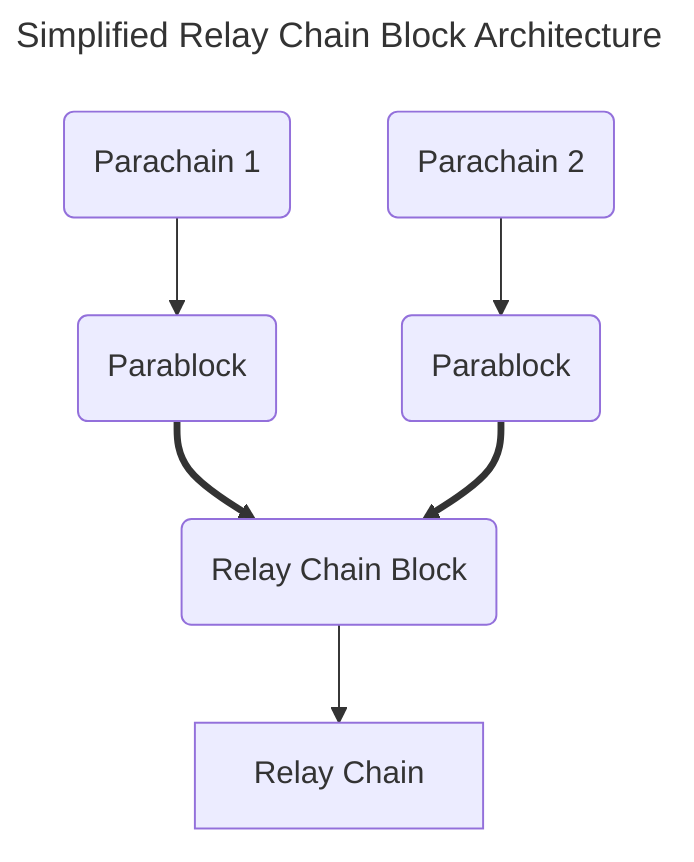
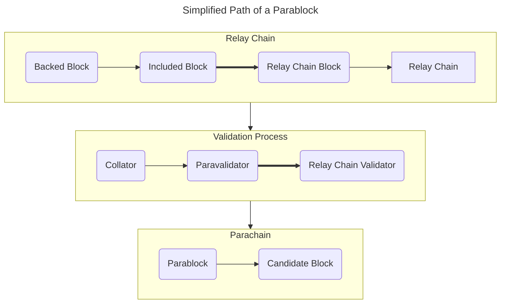

The relay chain relieves the parachain of the responsibility of economic security while also facilities interoperability.  There are several stages invovled from the collator, paravalidators, and the wider relay chain's validator set.

## The Path of a Parablock

If you recall the diagram from Network Components, you will notice a simplified path that the parablock travels in order to be included to the relay chain:

However, there is a more involved process that is enabling for state transitions from a parachain to be validated and included on the relay chain.

:::info State transition? Transaction? Extrinsic? What's the difference?

Up until this point, the term **state transition** has been repeated a few times.  To reiterate, a state transition merely represent some State A moving to some State B, of which the blockchain must validate as honest and abiding, or reject due to invalidity.

:::

The path of the parablock, at a high level, must undergo several stages before it is to be included and finalized on the relay chain.  

There are three primary stages of a parablock before it is included:

- A subset of paravalidators are selected on the relay chain to validate a particular parachain.
- The parachain's collator passes the block, considered a "Candidate" to the relay chain.
- The collator also passes the PVF, or **parachain validation function**, to the paravalidators.  The PVF validates that the transitions in the candidate block is valid.
- A candidate block gets **backed** by the paravalidators, and contains a **Proof of Validity**, or **PoV**.
- The validators on the relay chain, after a second series of checks, include the block.

For a more thorough explanation, refer to the ["The Path of a Parachain Block" by Joe Petrowski](https://polkadot.network/blog/the-path-of-a-parachain-block) and the [Polkadot Wiki](https://wiki.polkadot.network/docs/learn-parachains-protocol).

## Requirements for a Parachain

In the list above, note the terms: **Parachain Validation Functio**n and **Proof of Validity** conc

- A Parachain Validation Function, or **PVF**, is essentially the Wasm runtime of a parachain.  It defines how state is supposed to transition for that certain parachain.
- The proof of validity is generated once the state is able to be verified.  The entire state of the parachain doesn't need to be verified - just the proposed state changes for that particular parablock.

In the section page, we also discussed Cumulus, a Parachain Development Kit based on FRAME and Substrate.  Cumulus provides the functions needed for collators to provide the PVF and information for the proof of validity to be generated, which is required for the parachain to finalize its state on the relay chain.