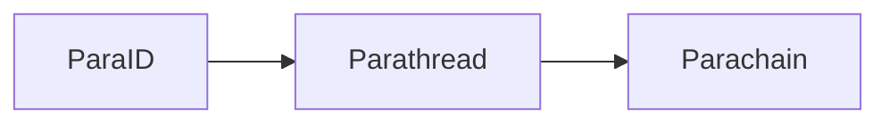
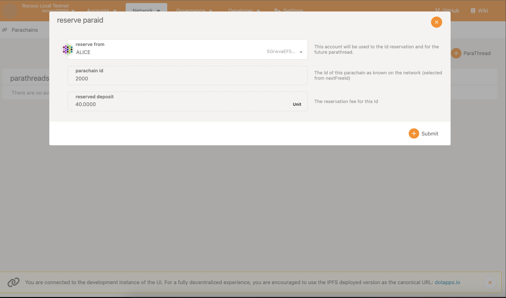

Before registering and uploading your parachain's runtime, you must register a `ParaId`. Each
parachain has a unique ID on the relay chain. The process of a parachain goes in the order of:

In order to obtain either a parathread or parachain, need a ParaID. Note that with the `sudo`
pallet, we can actually skip the parathread stage, as we can directly register our parachain using
the `parasSudoWrapper.sudoScheduleParaInitialize` extrinsic, as seen in the next section.

:::info Different RPC Ports for the Relay and Parachain

To connect to Polkadot.js, you will need to use the following URLs. Ensure both are running before
accessing:

- Relay Chain on
  [Port 9944](https://polkadot.js.org/apps/?rpc=ws%3A%2F%2F127.0.0.1%3A9944#/explorer)
- Parachain Collator on
  [Port 8844](https://polkadot.js.org/apps/?rpc=ws%3A%2F%2F127.0.0.1%3A8844#/explorer)

:::

## Reserving a ParaID

Navigate to the
[Polkadot.js Developer Console](https://polkadot.js.org/apps/?rpc=ws%3A%2F%2F127.0.0.1%3A9944#/explorer),
select the "Network" dropdown, and select "Parachains":

Select the "Parathreads" tab. Per our chain spec, our parachain indicates the ID is `2000`. Luckily,
the default starting `ParaId` is 2000, as stated below:

Select `Alice` as per above, and send the extrinsic. Your parachain can now be registered using that
`ParaId` once the extrinsic is confirmed.
