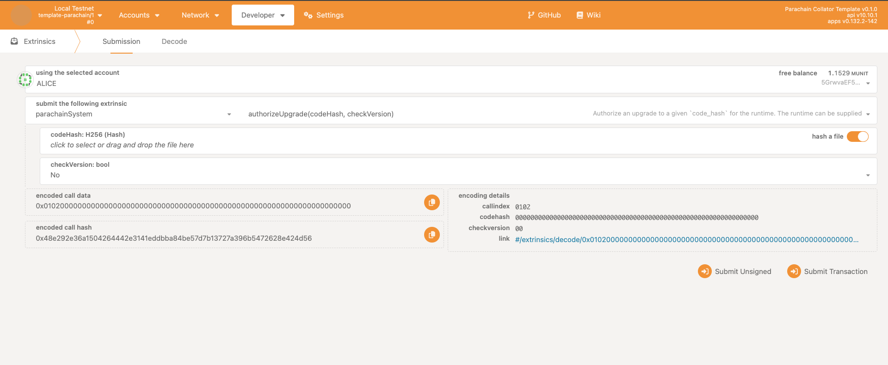

Congratulations, you have successfully registered a parachain on a local relay chain!

Now, you have a few options:

1.  Modify your existing parachain by either developing or adding **pallets**, and upgrading its
    runtime.
2.  Locally deploy more parachains with domain-specific functionality.
3.  Change the relay chain's core configuration and functionality.

Both options will require changes to the code base(s), and for the binaries to be re-compiled. In
the case of the parachain, the parachain must be upgraded to utilize the new runtime.

## How to approach customizing your parachain

As the parachain template provided is mostly a Substrate node that uses FRAME, one can either add or
develop new pallets for their runtime. Pallets are how one can extend the base functionality of the
template used here. To view a full list of pallets, view
[`polkadot-sdk/substrate/frame`](https://github.com/paritytech/polkadot-sdk/tree/master/substrate/frame).

For an example of developing a pallet from scratch, check out our
[Intro to Substrate course](../../../introsubstrate.md).

## Adding pallets - `pallet_assets` example

The parachain we just registered didn't have very many features - in fact, beyond managing user
balances, it doesn't offer much in the way of functionality. Let's run through how you may add an
existing FRAME pallet - `pallet_assets`.

`pallet_assets` is a pallet that specializes in allowing users to create **fungible** assets. In
other words, using pallet_assets, you could create different currencies on your chain.

A pallet is simply a Rust crate, meaning it has to be added as a dependency of our runtime.

1. Add it to `runtime/lib.rs`'s `Cargo.toml` like so:

```toml
[dependencies]
pallet-assets = { git = "https://github.com/paritytech/substrate", default-features = false, branch = "polkadot-v1.0.0" }

# Make sure to add it as part of std:
std = [
# ...
"pallet-assets/std",
# ...
```

2. Add this configuration to your `runtime/lib.rs` (taken from
   [extended-parachain-template](https://github.com/paritytech/extended-parachain-template)):

```rust
parameter_types! {
    pub const AssetDeposit: Balance = 10 * UNIT;
    pub const AssetAccountDeposit: Balance = deposit(1, 16);
    pub const ApprovalDeposit: Balance = EXISTENTIAL_DEPOSIT;
    pub const StringLimit: u32 = 50;
    pub const MetadataDepositBase: Balance = deposit(1, 68);
    pub const MetadataDepositPerByte: Balance = deposit(0, 1);
}

impl pallet_assets::Config for Runtime {
    type RuntimeEvent = RuntimeEvent;
    type Balance = Balance;
    type RemoveItemsLimit = ConstU32<1000>;
    type AssetId = u32;
    type AssetIdParameter = Compact<u32>;
    type Currency = Balances;
    type CreateOrigin = AsEnsureOriginWithArg<EnsureSigned<AccountId>>;
    type ForceOrigin = EnsureRoot<AccountId>;
    type AssetDeposit = AssetDeposit;
    type AssetAccountDeposit = AssetAccountDeposit;
    type MetadataDepositBase = MetadataDepositBase;
    type MetadataDepositPerByte = MetadataDepositPerByte;
    type ApprovalDeposit = ApprovalDeposit;
    type StringLimit = StringLimit;
    type Freezer = ();
    type Extra = ();
    type CallbackHandle = ();
    type WeightInfo = pallet_assets::weights::SubstrateWeight<Runtime>;
    #[cfg(feature = "runtime-benchmarks")]
    type BenchmarkHelper = ();
}
```

3. At the top of your `lib.rs`, ensure you have the proper imports:

```rust
use frame_system::EnsureSigned;
use codec::Compact;
use frame_support::traits::AsEnsureOriginWithArg;
```

4. Add this convenience function for easily calculating deposits at the top as well, below
   `EXISTENTIAL_DEPOSIT`:

```rust
pub const fn deposit(items: u32, bytes: u32) -> Balance {
    (items as Balance * 20 * UNIT + (bytes as Balance) * 100 * MICROUNIT) / 100
}
```

5. Finally, add it to `construct_runtime!` with the other pallets. It will look like this:

```rust
construct_runtime!(
    pub enum Runtime
    {
                // ...
        Assets: pallet_assets = 51, // some arbitrary id for the pallet, should be higher than the last pallet.
                // ...
    }
);
```

Once complete, you should be able to build (`cargo build --release`) and re-launch your collator.
Keep in mind you will also have to upgrade your parachain.

#### Upgrading your parachain with a new runtime

If your runtime has changed, you need to upgrade your parachain. As the relay chain holds the PVF of
your parachain, it also needs to be part of the upgrade process.

Upgrading your parachain usually involves two steps, both done using the `parachainSystem` pallet:

1. **Authorize the upgrade by providing its hash via the `authorize_upgrade` extrinsic:**



2. **Enact the upgrade via the `enact_authorized_upgrade` extrinsic:**


These first notify the relay chain of the new PVF, then actually enact that upgrade with our new
runtime.

In PolkadotJS, both extrinsics can accept the runtime, where the first one hashes it, and the second
one accepts the full runtime code, where it applies the upgrade.

## Register a second, custom parachain

Another, more advanced option would be to provision another parachain. It would follow the same
process as described, only you could challenge yourself by adding an XCM config to enable
cross-consensus messaging within your network. Another option would be to configure it as a system
parachain, which is a parachain that fulfills a specific role and uses the relay chain as a form of
economic security.
