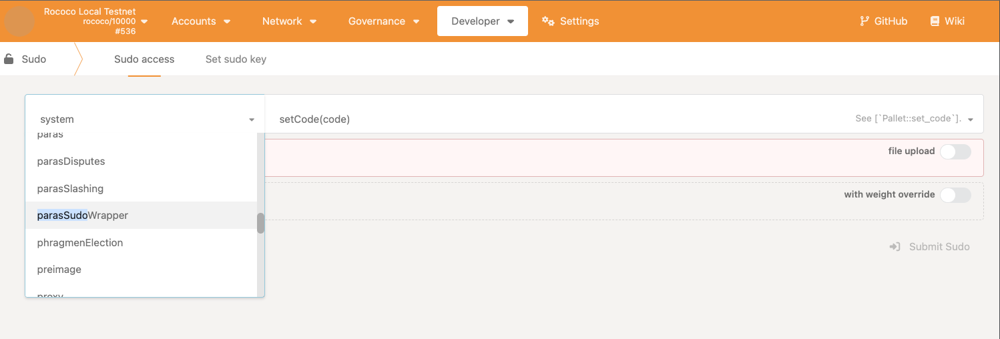
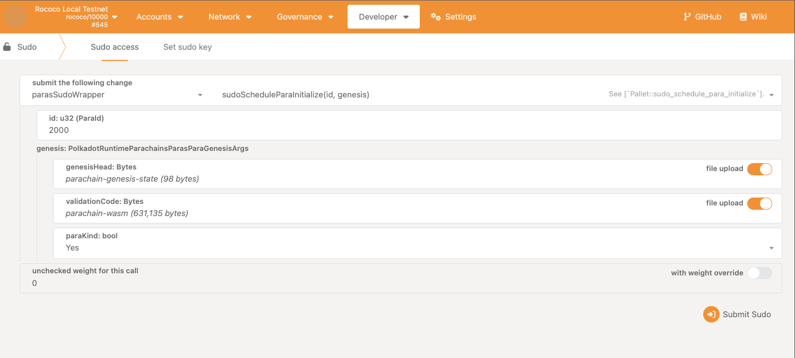
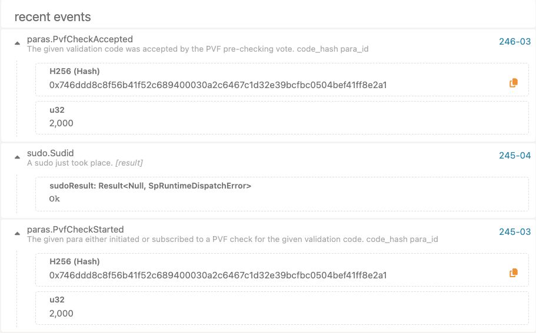
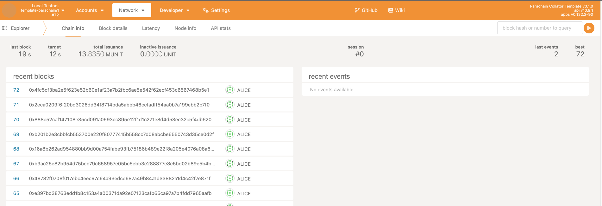

Typically, a parachain slot auction would have to take place to achieve a connection with the relay chain.  These auctions can take some time - usually one week, with multiple parachains competing for a slot in the relay chain.  

One possibility is to modify our relay chain's code to lower auction times.  However, this still is unideal for development purposes.

A significant side effect of running our local relay chain includes bypassing that process via our type of governance - `sudo`.

## A Brief Introduction to the Sudo Pallet

The [`sudo`](https://paritytech.github.io/polkadot-sdk/master/pallet_sudo/index.html) pallet executes calls that require `Root` origin with any keys that are declared as "sudo".  In most development environments, `Alice` is one of these keys.  Adding more keys if needed via the `set_key` extrinsic is also possible.

It primarily acts as a wrapper for other calls.  It is not meant to be used in pallets directly but rather merely execute privileged calls that require the `Root` origin.

## Using Sudo as Governance in Polkadot.js

Using the `sudo` pallet, we can bypass the auction process and register the parachain directly.  

:::caution Make sure your collator is running!

To register our parachain, we need both our relay chain creating blocks and our parachain's collator running.

:::

Navigate to the [Polkadot.js Developer Console](https://polkadot.js.org/apps/?rpc=ws%3A%2F%2F127.0.0.1%3A9944#/explorer), and select the `Sudo` tab:


Once here, select the `parasSudoWrapper` in the dropdown:



Upload the genesis (`parachain-genesis-state`) and runtime (`parachain-wasm`) from the `parachain-guide-resources` repository:



In the "Events" tab in the explorer, you should see two events - `sudo.Sudid` and `paras.PvfCheckAccepted`.  These should indicate that the parachain's runtime has been successfully registered, and the collator will start syncing with the relay chain.



## Ensuring Collation

Your collator should have output similar to the following: 

```sh
2023-09-13 13:03:48 [Parachain] 🙌 Starting consensus session on top of parent 0x8d239901c4ee0eca7b10f97744bd2812e2682cd92a3e15c254931fb631af6289
2023-09-13 13:03:48 [Parachain] 🎁 Prepared block for proposing at 198 (1 ms) [hash: 0xd5ab5c88bbc45c00500059d001303961fc43c2821f21c9939b44be5ec983dfb9; parent_hash: 0x8d23…6289; extrinsics (2): [0xc24e…cf43, 0xc8c9…86a5]
2023-09-13 13:03:48 [Parachain] 🔖 Pre-sealed block for proposal at 198.  Hash now 0x17eb48b6a0cca5cabfa3651961732b4095fa9a7edc77066ba310d3243342fba2, previously 0xd5ab5c88bbc45c00500059d001303961fc43c2821f21c9939b44be5ec983dfb9.
2023-09-13 13:03:48 [Parachain] ✨ Imported #198 (0x17eb…fba2)
2023-09-13 13:03:48 [Parachain] PoV size { header: 0.21875kb, extrinsics: 3.1298828125kb, storage_proof: 3.2939453125kb }
2023-09-13 13:03:48 [Parachain] Compressed PoV size: 6.048828125kb
2023-09-13 13:03:48 [Parachain] Produced proof-of-validity candidate. block_hash=0x17eb48b6a0cca5cabfa3651961732b4095fa9a7edc77066ba310d3243342fba2
```

In Polkadot.js, you should also see block production occurring on both the relay and parachain:



If not, you may have forgotten to specify a bootnode.  You may restart your collator and specify a relay chain validator using the `--bootnodes` flag.

