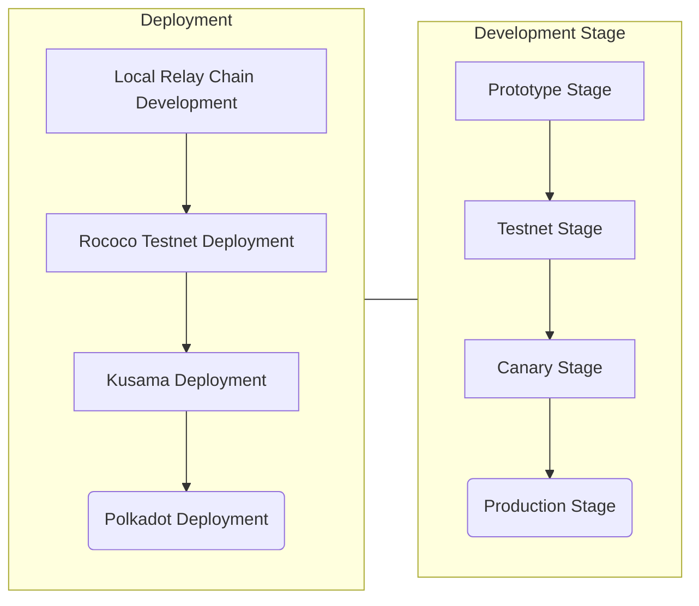

The road to production for a parachain can be a daunting process. Luckily, there is a clear path to
progression from prototype, to testnet, to canary (if desired), to production.

:::info The following is empirical advice

The following is mostly based off of common approaches that have been implemented over the years.

:::

## Parachain Development Funnel

A parachain usually goes through the following "development funnel" from prototype to production:

Most parachains within the ecosystem have adopted this pattern of deployment. This guide shows you
how to accomplish the first part with a setup catered to local development. After this, it is
typical to look to deploy to a testnet, such as
[Rococo](./deployment-strat.md#testnet---deploying-on-Rococo). After that, most parachains opt to
either go directly to [Polkadot](./deployment-strat.md#production---deploying-on-polkadot), or setup
a canary network on [Kusama](./deployment-strat.md#canary---deploying-on-kusama).

There are quite a few parachains which have networks both on Kusama and Polkadot.

:::info What's the purpose of deploying on a canary network?

Most parachains use Kusama as a 'chaotic' testing ground for ensuring their network work in a
production-like setting.

:::

## Existing References

There are a number of different parachains to reference. All use Substrate as the base, but have
varying implementations depending on their usecase.

## Parachain Design Decisions

When building a parachain, there are a number of design decisions that go beyond pure code.
Parachains should be concerned with maximizing the blockspace they purchase, whether that is through
auction or pay to go schemes.

In order to do this, more elaborate schemes containing game theory and economics are often involved
to ensure the parachain itself remains a "closed-feedback loop" so to speak.

:::info But I thought Polkadot Secures My Parachain For Me?

The parachain's consensus and finality is guranteed by Polkadot, yes. However, the parachain itself
is responsible for the business logic, whether it chooses to incentivize its collators, any staking
mechanisms, and any other domain specific logic. It is possible for an attacker to exploit a
parachain's mechanism if it isn't designed well or contains a vector for attack.

:::

### Game Theory & Economics

To learn more about **applied** game theory and economics aspects, check out the
[Polkadot Blockchain Academy's](https://polkadot-blockchain-academy.github.io/pba-book/economics/index.html)
section on it.

### On Collation

Collators are necessary to keep the parachain syncing and finalizing with the relay chain. A
parachain only really needs one, **honest** collator at minimum, however it is advisable to have
more to ensure resilience.

## Stuck? Ask on StackExchange, or reach out on the Polkadot Forum

If you get stuck on a technical issue, make sure to ask on
[The Substrate Stack Exchange](https://substrate.stackexchange.com/). It often has those more
acquainted with the protocol ready to answer any technical questions.

If you want to get feedback for an idea or consult the wider ecosystem, feel free to post on the
[Polkadot Forum](https://forum.polkadot.network/).
