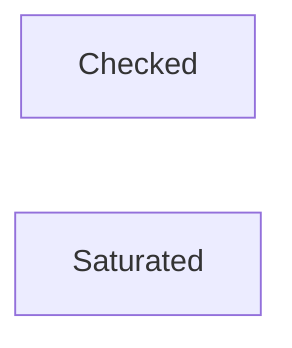

<!-- prettier-ignore -->
:::warning This page is under construction

:::

Small things like adding or subtracting numbers can present some novel scenarios. As our runtime
should _never_ panic; this includes eliminating the possibility of integer overflows, converting
between number types, or even handling floating point usage with fixed point arithmetic to mitigate
issues that they can present.

:::tip To follow along, you can use `sp_arithmetic`

The following code may use types that Substrate provides. Feel free to follow along by including
these crates in your `Cargo.toml` as follows:

```toml
sp-arithmetic = "19.0.0-dev.1"
```

:::

## Integer Overflow

In runtime, we don't always have control over what is being supplied as a parameter. For example,
this counter function could present one of two outcomes depending on whether it is in **release** or
**debug** mode:

```rust
fn count(x: u8) -> u8 {
    let overflow = u8::MAX + x;
    overflow
}

count(10); // In debug mode, this would panic. In release, `u32::MAX` would be 9.
```

The Rust compiler would panic in **debug** mode in the event of an integer overflow. In **release**
mode, it resorts to _wrapping_ the overflowed amount in a modular fashion, (hence returning `9`).

While this may seem "safe" on the surface, wrapping could present unintended consequences in the
context of blockchain development. A quick example is a user's balance overflowing - the default
behavior of wrapping would result in the user's balance starting from zero!

Luckily, there are ways to both represent and handle these scenarios depending on our specific use
case natively built into Rust, as well as libraries like `sp_arithmetic`.

## Safe Math

Our main objective is to reduce the likelihood of any point of failure within our blockchain
runtime. Both Rust and Substrate both provide safe ways to deal with numbers and alternatives to
floating point arithmetic.

:::info Defensive, or safe math, isn't just useful for blockchain development.

Traditional banking also needs to utilize such practices within its codebase. Rather than use purely
primitive, native types, **fixed-point arithmetic** usually involves abstracting such operations
into more controlled, fixed-point types.

A prime example is that banking also doesn't use floating point numbers. Rather they use fixed-point
arithmetic to mitigate the potential for inaccuracy, rounding errors, or other unexpected behavior.

Using **primitive** floating point number types in a blockchain context should also be avoided, as a
single nondeterministic result could cause chaos for consensus along with the aforementioned issues.

:::

The following methods represent different ways one can handle numbers safely natively in Rust.

### Checked Operations

**Checked operations** utilize a `Option<T>` as a return type. This means that if the resulting
operation is invalid, i.e., an integer overflow, it will return `None`, and if successful, then
`Some`. The only downside of using this type is the need to handle the `Option` type accordingly.

This is an example of a valid operation:

```rust
#[test]
fn checked_add_example() {
    // This is valid, as 20 is perfectly within the bounds of u32.
    let add = 10u32.checked_add(10);
    assert_eq!(add, Some(20))
}
```

This is an example of an invalid operation, in this case, a simulated integer overflow, which would
simply result in `None`:

```rust
#[test]
fn checked_add_handle_error_example() {
    // This is invalid - we are adding something to the max of u32::MAX, which would overflow.
    // Luckily, checked_add just marks this as None!
    let add = u32::MAX.checked_add(10);
    assert_eq!(add, None)
}
```

Typically, if you aren't sure about which operation to use, **checked** operations are the safe bet,
as it presents two, predictable outcomes that can be handled. In reality, checked operations aren't
utilized much within the Polkadot codebase, but are still a valid way to ensure safety is a part of
your runtime's design.

In a real context, the resulting `Option` should be handled accordingly. The following function is
from the
[`polkadot-sdk`](https://github.com/paritytech/polkadot-sdk/blob/c86b633695299ed27053940d5ea5c5a2392964b3/bridges/modules/messages/src/inbound_lane.rs#L168),
and part of it increases a nonce which is responsible as part of receiving a message from a bridge
protocol:

```rust
/// Receive new message.
pub fn receive_message<Dispatch: MessageDispatch>(
    &mut self,
    relayer_at_bridged_chain: &S::Relayer,
    nonce: MessageNonce,
    message_data: DispatchMessageData<Dispatch::DispatchPayload>,
) -> ReceivalResult<Dispatch::DispatchLevelResult> {
    let mut data = self.storage.get_or_init_data();
    if Some(nonce) != data.last_delivered_nonce().checked_add(1) {
        return ReceivalResult::InvalidNonce
    }
    // ...
```

Because wrapped operations return `Option<T>`, the above syntax of:

```rust
if Some(value) = some_option.checked_add(1) {
    // do something with value..
} else {
    // oh no, an overflow!
}
```

Is a good convention to use for hand line not only checked types, but most types that return
`Option<T>`.

#### Checked Operations: Result Flavored

In the Polkadot SDK codebase, you may see checked operations being handled as a `Result`. For
example, the following code is used in the `contracts` pallet to determine
[if there is enough gas via `checked_sub`](https://github.com/paritytech/polkadot-sdk/blob/f6560c2b7226ea756ade18df42018c3eaf3be2e0/substrate/frame/contracts/src/gas.rs#L122):

```rust
//...
self.gas_left = self.gas_left.checked_sub(&amount).ok_or_else(|| <Error<T>>::OutOfGas)?;
//...
```

At a glance, this may seem confusing, as we just got done explaining how to handle a `Option`, not
`Result`. `Result` may be used as an alternative to `Option` where it ergonomically makes sense to
let the user know that something unexpected has happened. This is particularly useful in the context
of dispatchables within a Substrate pallet, for example.

:::tip `ok_or` or `ok_or_else`?

You may see `ok_or` and `ok_or_else` being used interchangeably. In reality, they have the same
functionality with one caveat - `ok_or` is _eagerly_ evaluated, versus `ok_or_else` is _lazily_
evaluated. Using `ok_or_else` is more performant, as if the `Option` is `Some()`, there is no need
to actually run the closure. `ok_or` is eager to make new allocations - regardless of whether it is
relevant or not, thereby making it slightly more expensive.

[See more here.](https://rust-lang.github.io/rust-clippy/master/index.html#/or_fun_call)

:::

### Saturated Operations

Saturating a number of limits it to its numeric bound, no matter the integer would overflow in
runtime. For example, adding to `u32::MAX` would simply limit itself to `u32::MAX` :

```rust
#[test]
fn saturated_add_example() {
    // Saturating add simply 'saturates' to the numeric bound of that type if it overflows.
    let add = u32::MAX.saturating_add(10);
    assert_eq!(add, u32::MAX)
}
```

Saturating calculations can be used if one is very sure that something won't overflow, but wants to
avoid introducing the notion of any potential-panic or wrapping behavior.

### Operations in Substrate Development - Further Context

As a recap, we covered the following concepts:

1. **Checked** operations,
2. **Saturated** operations,
3. **Wrapped** operations,

**Wrapped operations** cause the overflow to revert to 0 - imagine this in the context of a
blockchain, where are balances, voting counters, nonces for transactions, and other aspects. Some of
these mechanisms can be more critical than others. Its for this reason that we may consider some
other ways of dealing with runtime arithmetic that won't carry these consequences.

While it may seem trivial, choosing how to handle numbers is quite important. As a thought exercise,
here are some scenarios of which will shed more light on when to use which.

<!-- todo: add solutions to better approaches to these examples -->

1.  **Bob's** balance exceeds the `Balance` type on the `EduChain`. Because the pallet developer did
    not handle the calculation to add to Bob's balance with any regard to this overflow, **Bob's**
    balance is now essentially `0`, the operation **wrapped**.

2.  **Alice's** balance has reached `0` after a transfer to `Bob`. Suddenly, she has been slashed on
    `EduChain`, causing her balance to reach near the limit of `u32::MAX` - a very large amount - as
    _checked operations_ can go both ways. **Alice** can now successfully vote using her new token
    balance, destroying the integrity of the chain.

3.  The type for counting the number of proposals on-chain is represented by a `u8` number, called
    `proposals_count`. Every time a new proposal is added to the system, this number increases. With
    the proposal pallet being high in usage, it has reached `u8::MAX`'s limit of `255`, causing
    `proposals_count` to go to `0`. Unfortunately, this resulted in new proposals overwriting old
    ones, effectively erasing any notion of past proposals!

### Decision Chart: When to use which? (todo)



## Fixed Point Arithmetic

Fixed point arithmetic solves the aforementioned problems of dealing with the (sometimes) uncertain
nature of floating point numbers. Rather than use a radix point (`0.80`), a type which _represents_
a floating point number in base 10 can be used instead.

Let's see how `sp_arithmetic`, a library within Substrate, allows us to easily take advantage of the
capabilities of fixed point arithmetic:

### Using 'PerThing'

[`sp_arithmetic`](https://paritytech.github.io/polkadot-sdk/master/sp_arithmetic/) contains a trait
called
[`PerThing`](https://paritytech.github.io/polkadot-sdk/master/sp_arithmetic/per_things/trait.PerThing.html),
allowing a custom type to be implemented specifically for fixed point arithmetic. One example is
[`Percent`](https://paritytech.github.io/polkadot-sdk/master/sp_arithmetic/per_things/struct.Percent.html),
which implements `PerThing`, and allows for percentages to be calculated safely:

```rust
#[test]
fn percent_example() {
    let percent = Percent::from_rational(190u32, 400u32);
    assert_eq!(percent.deconstruct(), 47)
}
```

Note that `190 / 400 = 0.475`, and that `Percent` represents it as a _rounded down_, fixed point
number (`47`). Unlike primitive types, types that implement `PerThing` will also not overflow, and
are therefore safe to use. They adopt the same behavior that a saturated calculation would provide:

```rust
#[test]
fn percent_example_overflow() {
    let percent = Percent::from_rational(50032, 400u32);
    assert_eq!(percent.deconstruct(), 100)
}
```

If percent isn't precise enough,
[`Perbill`](https://paritytech.github.io/polkadot-sdk/master/sp_arithmetic/per_things/struct.Perbill.html)
or
[`Permill`](https://paritytech.github.io/polkadot-sdk/master/sp_arithmetic/per_things/struct.Permill.html)
(parts of a billion and million respectively) can be used for operations that require it.

### Fixed Point Arithmetic with `sp_arithmetic`

As stated, one can also perform mathematics using these types directly. For example, multiplication:

```rust
#[test]
fn percent_mult() {
    let percent = Percent::from_rational(5u32, 100u32); // aka, 5%
    assert_eq!(percent.int_mul(5).deconstruct(), 25)
}
```

Or also division:

```rust
#[test]
fn percent_div() {
    let percent = Percent::from_rational(50u32, 100u32);
    let other_percent = Percent::from_parts(10);

    assert_eq!(percent.int_div(other_percent), 5)
}
```

Either way, you can safely deconstruct (or construct) and interact with representatives of these
numbers.

Later, in the context of a FRAME pallet, the usage of these types and calculations will start to
make more sense when dealing with mathematics in the runtime.
