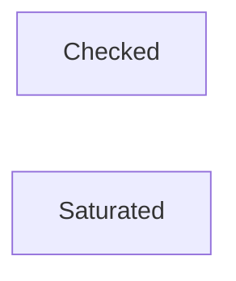

<!-- prettier-ignore -->
:::warning This page is under construction

:::

Small things like adding or subtracting numbers can present some novel scenarios. As our runtime
should _never_ panic; this includes eliminating the possibility of integer overflows, converting
between number types, or even handling 'currency' math.

:::tip To follow along, you can use `sp_arithmetic`

The following code may use types that Substrate provides. Feel free to follow along by including
these crates in your `Cargo.toml` as follows:

```toml
sp-arithmetic = "19.0.0-dev.1"
```

:::

## Integer Overflow

In Rust, integer overflow is possible in **debug** mode, where the compiler would panic. In release
mode, it resorts to wrapping the overflowed amount in a modular fashion:

```rust
let max = u8::MAX + 10; // In debug mode, this would panic. In release, `u32::MAX` would be 9.
```

However, you may only sometimes want to wrap your integers. What if a user's balance is changing
within your runtime? In an overflow, the default behavior of wrapping a value would result in the
user's balance starting from zero!

Luckily, there are ways to both represent and handle these scenarios depending on our specific use
case natively built into Rust.

## Safe Math

Our primary goal is to reduce any point of failure within our blockchain runtime. Both Rust and
Substrate both provide safe ways to deal with numbers, alternatives to floating point arithmetic,
and currency math.

:::info Defensive, or safe math, wasn't just because of blockchain.

Traditional banking also needs to utilize such practices within its codebase. Rather than use purely
primitive, native types, **currency** math usually involves abstracting such operations into more
controlled, fixed-point types.

A prime example is that banking also doesn't use floating point numbers. Rather they use fixed-point
arithmetic to mitigate the potential for inaccuracy, rounding errors, or other unexpected behavior.

Cases such as floating point numbers in critical environments (like blockchains) should still be
avoided.

:::

Rust has numerous, native ways to perform these operations safely. The following methods represent
different ways one can handle numbers safely.

### Checked Operations

**Checked operations** utilize a `Option<T>` as a return type. This means that if the resulting
operation is invalid, i.e., an integer overflow, it will return `None`, and if successful, then
`Some`. The only downside of using this type is the need to handle the `Option` type accordingly.

This is an example of a valid operation:

```rust
#[test]
fn checked_add_example() {
    // This is valid, as 20 is perfectly within the bounds of u32.
    let add = 10u32.checked_add(10);
    assert_eq!(add, Some(20))
}
```

This is an example of an invalid operation, in this case, a simulated integer overflow, which would
simply result in `None`:

```rust
#[test]
fn checked_add_handle_error_example() {
    // This is invalid - we are adding something to the max of u32::MAX, which would overflow.
    // Luckily, checked_add just marks this as None!
    let add = u32::MAX.checked_add(10);
    assert_eq!(add, None)
}
```

### Wrapped Operations

Wrapped operations simply overflow the number back to 0 plus the remainder (modulo, essentially).
Wrapped operations typically do not have to

```rust
#[test]
fn wrapped_add_example() {
    // Wrapping add wraps around the difference of the overflow.
    // For example, the overflow here is 9 over (since adding 1 would cause the overflow)
    let add_explicit = u32::MAX.wrapping_add(10);
    assert_eq!(add_explicit, 9);
}
```

This is the default behavior in _release_ mode, meaning it does not have to be explicitly used. For
example, the following code illustrates what would happen at runtime if a number happened to cause
an overflow:

```rust
#[test]
fn wrapped_add_release_example() {
    // However, the above is the same as the below when compiled for release mode:
    // Get a random number:
    let mut rng = rand::thread_rng();
    let n1: u32 = rng.gen_range(1..10);
    // Add this (unknown at compile time):
    let add_implicit: u32 = u32::MAX + n1;
    // Will take some number from 1 to 10, and wrap around.  The result could be any number from 1 to 9.
    assert_eq!(add_implicit, u32::MAX + n1);
}
```

### Saturated Operations

Saturating a number limits it to its numeric bound. For example, adding to `u32::MAX` would simply
limit itself to `u32::MAX`:

```rust
#[test]
fn saturated_add_example() {
    // Saturating add simply 'saturates' to the numeric bound of that type if it overflows.
    let add = u32::MAX.saturating_add(10);
    assert_eq!(add, u32::MAX)
}
```

Saturating calculations can be used if one is very sure that something won't overflow, but wants to
avoid introducing the notion of any potential-panic or wrapping behavior.

### Operations in Substrate Development - Further Context

As a recap, we covered the following concepts:

1. **Wrapped** operations,
2. **Saturated** operations,
3. **Checked** operations,

**Wrapped operations** cause the overflow to revert to 0 - imagine this in the context of a
blockchain, where are balances, voting counters, nonces for transactions, and other aspects. Some of
these mechanisms can be more critical than others. Its for this reason that we may consider some
other ways of dealing with runtime arithmetic that won't carry these consequences.

While it may seem trivial, choosing how to handle numbers is quite important. As a thought exercise,
here are some scenarios of which will shed more light on when to use which.

1.  **Bob's** balance exceeds the `Balance` type on the `EduChain`. Because the pallet developer did
    not handle the calculation to add to Bob's balance with any regard to this overflow, **Bob's**
    balance is now essentially `0`, the operation **wrapped**.

2.  **Alice's** balance has reached `0` after a transfer to `Bob`. Suddenly, she has been slashed on
    `EduChain`, causing her balance to reach near the limit of `u32::MAX` - a very large amount - as
    _checked operations_ can go both ways. **Alice** can now successfully vote using her new token
    balance, destroying the integrity of the chain.

3.  The type for counting the number of proposals on-chain is represented by a `u8` number, called
    `proposals_count`. Every time a new proposal is added to the system, this number increases. With
    `u8::MAX`'s limit being `255`

### When to use which? (todo)



## Fixed Point Arithmetic

Fixed point arithmetic solves the aforementioned problems of dealing with the (sometimes) uncertain
nature of floating point numbers. Rather than use a radix point (`0.80`), a type which _represents_
a floating point number in base 10 can be used instead.

Let's see how `sp_arithmetic`, a library within Substrate, allows us to easily take advantage of the
capabilities of fixed point arithmetic:

### Using 'PerThing'

[`sp_arithmetic`](https://paritytech.github.io/polkadot-sdk/master/sp_arithmetic/) contains a trait
called
[`PerThing`](https://paritytech.github.io/polkadot-sdk/master/sp_arithmetic/per_things/trait.PerThing.html),
allowing a custom type to be implemented specifically for fixed point arithmetic. One example is
[`Percent`](https://paritytech.github.io/polkadot-sdk/master/sp_arithmetic/per_things/struct.Percent.html),
which implements `PerThing`, and allows for percentages to be calculated safely:

```rust
#[test]
fn percent_example() {
    let percent = Percent::from_rational(190u32, 400u32);
    assert_eq!(percent.deconstruct(), 47)
}
```

Note that `190 / 400 = 0.475`, and that `Percent` represents it as a _rounded down_, fixed point
number (`47`). Unlike primitive types, types that implement `PerThing` will also not overflow, and
are therefore safe to use. They adopt the same behavior that a saturated calculation would provide:

```rust
#[test]
fn percent_example_overflow() {
    let percent = Percent::from_rational(50032, 400u32);
    assert_eq!(percent.deconstruct(), 100)
}
```

If percent isn't precise enough,
[`Perbill`](https://paritytech.github.io/polkadot-sdk/master/sp_arithmetic/per_things/struct.Perbill.html)
or
[`Permill`](https://paritytech.github.io/polkadot-sdk/master/sp_arithmetic/per_things/struct.Permill.html)
(parts of a billion and million respectively) can be used for operations that require it.

### Fixed Point Arithmetic with `sp_arithmetic`

As stated, one can also perform mathematics using these types directly. For example, multiplication:

```rust
#[test]
fn percent_mult() {
    let percent = Percent::from_rational(5u32, 100u32);
    assert_eq!(percent.int_mul(5).deconstruct(), 25)
}
```

Or also division:

```rust
#[test]
fn percent_div() {
    let percent = Percent::from_rational(50u32, 100u32);
    let other_percent = Percent::from_parts(10);

    assert_eq!(percent.int_div(other_percent), 5)
}
```

Either way, you can safely deconstruct (or construct) and interact with representatives of these
numbers.

Later, in the context of a FRAME pallet, the usage of these types and calculations will start to
make more sense when dealing with mathematics in the runtime.
