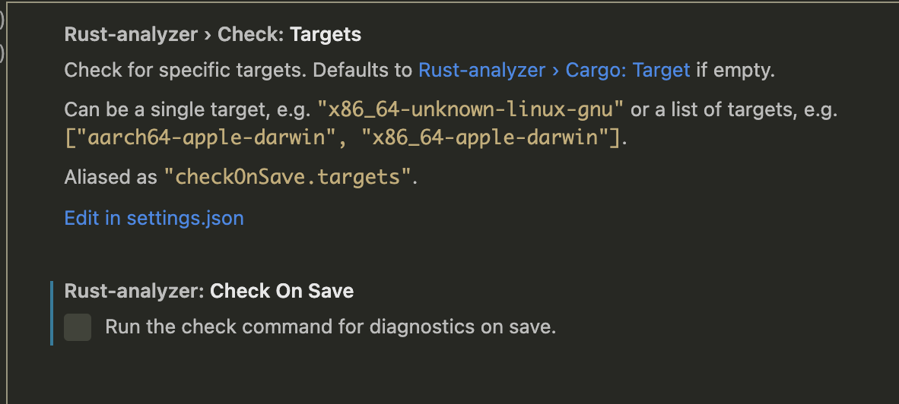
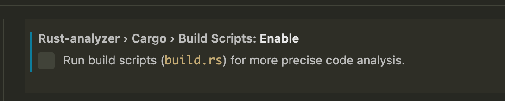

The Rust analyzer is a powerful tool for developing or utilizing Rust crates. Substrate is a very
extensive library - which can result in the analyzer having long loading times if it attempts to
rebuild often. The following are specific settings for VSCode - however, the same settings may also
be used for your specific editor of choice.

Of course, one could disable it completely, and this is a choice if the below do not aid in a
performance increase.

## Disable cargo check and build

:::info Open VSCode!

Navigate to `Code > Settings > Settings` on macOS, or `File > Preferences > Settings`. Optionally,
you can also open it via the commands pallette.

Note that you may choose to do this per your **workspace** or overall **user settings**.

:::

If you're struggling to load Substrate projects, the following will help:

1. _Disable `checkOnSave`_.

By default, the Rust Analyzer can run `cargo check` on every save. If it is a large project, this
can have a lot of overhead, especially if you have auto save on:

You can choose to run `cargo check` on at your leisure.

2. _Disable auto-build / build script run_

By default, the Rust Analyzer also will build (via `build.rs`, if the workspace/crate contains one).
Disabling this also aids in performance:

