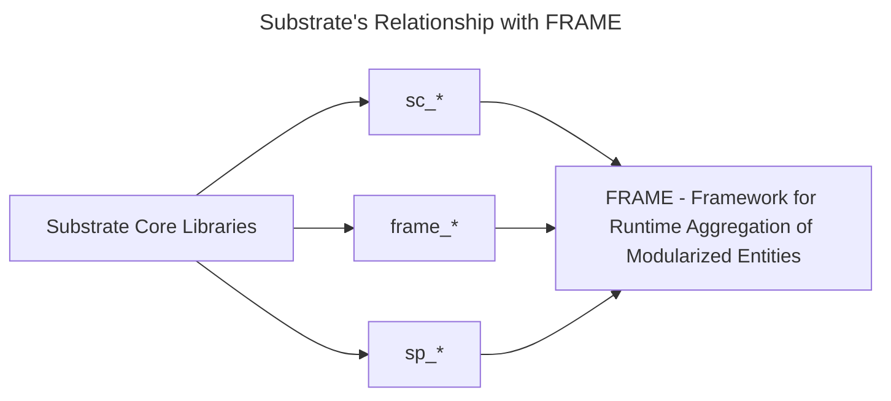

Substrate is a modular framework that enables you to create purpose-built blockchains by composing custom or pre-built components. The *Framework for Runtime Aggregation of Modularized Entities (**FRAME**)* is a set of modules and support libraries that simplify runtime development. In Substrate, these modules are called **pallets**, each hosting domain-specific logic to include in a chain's runtime.

Substrate may be used to create a solo chain as well as parachain for a relay chain like Polkadot. At its core, it is a set of Rust crates that provide the most basic primitives and protocols needed to implement a distributed state machine, such as a blockchain.

Another way to think about Substrate is similar to how a web developer may use/think about React.  Where React provides core libraries used for manipulating the elements of the DOM via developer-defined components, Substrate also provides the base libraries and primitives needed to create a blockchain.  It was designed to not be opinionated via a highly generic codebase, which enables for a high degree customizability.

:::info The prerequisites to learning Substrate

In order to get the most out of Substrate, you should have a good knowledge of computer science and basic blockchain concepts. Terminology like header, **block**, **client**, **hash**, **transaction** and **signature** should be familiar. Substrate is built on the [Rust Programming language](https://www.rust-lang.org/), which makes use of novel design patterns to enable development of code that is safe and fast. Although you don't need to know Rust to get started with Substrate, a good understanding of Rust will allow you to become a better Substrate developer.

If you would to brush up or learn the basics of Rust, feel free to take our [Intro to Rust course](../../introrust.md).

:::

## Substrate's Libraries

Substrate, as mentioned, is a collection of Rust crates that define a generic way to implement a blockchain.  Although you will not be using very many of these libraries directly in this course, know that everything you will be using is built upon them. 

There are two primary prefixes you will encounter when developing with Substrate crates: `sc-` and `sp-`.  Crates prefixed with `sc-` usually refer to network related functionalities, such as peer-to-peer networking or consensus.  The `sp-` prefix usually indicates that the library in question is for allowing the outer node and runtime to communicate. 

 A few major crates that you will encounter are: 

- [`sp_runtime`](https://crates.parity.io/sp_runtime/index.html) - Runtime modules shared primitive types
- [`sp_core`](https://crates.parity.io/sp_core/index.html) - Shareable Substrate types
- [`sp_io`](https://crates.parity.io/sp_io/index.html) - I/O host interface for substrate runtime. Substrate runtime standard library as compiled when linked with Rust’s standard library.

These, along with many more, all pertain to building certain aspects of a particular distributed system.

## A Brief Introduction to FRAME (Framework for Runtime Aggregation of Modularized Entities)

A common question is: _If Substrate exists, then what is FRAME for? Why is it mentioned so often?_.

FRAME, or Framework for Runtime Aggregation of Modularized Entities, is another abstraction on top of Substrate. It introduces a set of conventions and structure for building a blockchain with Susbtrate through a number of Rust macros.  These macros enable for the powerful, and trivial to use system of **pallets** to construct **runtimes** using Substrate. A **runtime**, also called a **state transition function (STF)**, is used to define the state transitions for a particular blockchain.  

Remember, the core concept of what a blockchain is is a state machine.  FRAME facilitates the way for state to propagate and change in a way that is more developer-friendly.

:::info

Going forward, terminology such as **pallets**, which are custom bundles of business logic that make up a runtime, will be common.  If a term here is unfamiliar and undefined, feel free to reference the glossary.

:::