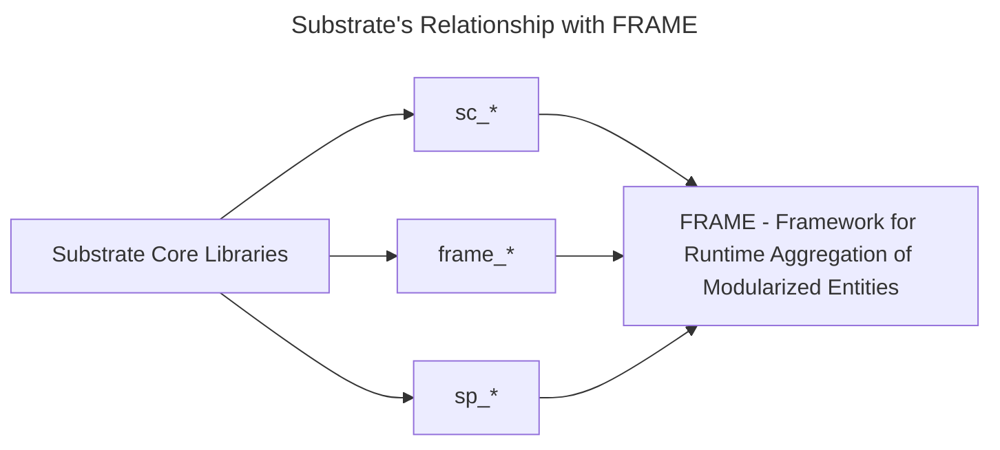

[Substrate](https://paritytech.github.io/substrate/master/substrate/index.html) is a modular
framework that enables you to create domain-specific blockchains by composing custom or pre-built
components. It is part of the [Polkadot SDK](https://github.com/paritytech/polkadot-sdk), and is
responsible for providing the tools needed to build blockchain **runtimes**.

<iframe width="560" height="315" src="https://www.youtube.com/embed/54u9E_7r5zA?si=82R9PojJiQ5R-VMl" title="YouTube video player" frameborder="0" allow="accelerometer; autoplay; clipboard-write; encrypted-media; gyroscope; picture-in-picture; web-share" allowfullscreen></iframe>

:::info Substrate is part of the Polkadot SDK (monorepo)

As of August, 2023, the **Polkadot**, **Substrate**, and **Cumulus** codebases were merged into one
monorepo. Now referred to as the [**Polkadot SDK**](https://github.com/paritytech/polkadot-sdk),
this monorepo represents all the primary tools needed to build blockchains using Substrate.

:::

The _Framework for Runtime Aggregation of Modularized Entities (**FRAME**)_ is a set of modules and
support libraries that simplify runtime development within Substrate. In Substrate, these modules
are called **pallets**, each hosting domain-specific logic to include in a chain's runtime.

Substrate may be utilized to create a solo chain or a parachain for a relay chain like Polkadot or
Kusama. At its core, it is a set of Rust libraries that provide the most basic primitives and
protocols to implement a distributed, peer-to-peer state machine, such as a blockchain.

:::info An analogy: React, the library for web and native user interfaces

Another way to think about Substrate is similar to how a web developer may use/think about
**React**. Where React provides core libraries for manipulating the elements of the DOM via
developer-defined components, Substrate also provides the base libraries and primitives needed to
create a blockchain. It was designed to not be opinionated via a highly generic codebase, enabling
high customizability.

:::

## Substrate's Libraries

Substrate, as mentioned, is a collection of Rust crates that define a generic way to implement a
blockchain. Although you will only use a few of these libraries directly in this course, know that
everything you use is built upon them.

You will encounter two primary prefixes when developing with Substrate crates: `sc-` (**Substrate
Client**) and `sp-` (**Substrate Primitive**). Crates prefixed with `sc-` usually refer to
network-related functionalities, such as peer-to-peer networking or consensus. The `sp-` prefix
usually indicates that the library provides primitives for a particular aspect of Substrate, such as
runtime-related primitives.

A few significant crates that you will encounter are:

- [`sp_runtime`](https://paritytech.github.io/substrate/master/sp_runtime/index.html) - Runtime
  modules shared primitive types
- [`sp_core`](https://paritytech.github.io/substrate/master/sp_core/index.html) - Shareable
  Substrate types
- [`sp_io`](https://paritytech.github.io/substrate/master/sp_io/index.html) - I/O host interface for
  substrate runtime. Substrate runtime standard library as compiled when linked with Rust’s standard
  library.

These, along with many more, all pertain to building certain aspects of distributed systems,
including but not limited to:

- Consensus mechanisms
- Peer-to-peer networking
- Fork-choice rules
- Block authoring
- State management

## A Brief Introduction to FRAME (Framework for Runtime Aggregation of Modularized Entities)

A common question is: _If Substrate exists, what is FRAME for? Why is it mentioned so often?_.

FRAME, or Framework for Runtime Aggregation of Modularized Entities, is another abstraction on top
of Substrate. It introduces a set of conventions and structures for building a blockchain with
Substrate through numerous Rust macros. These macros enable the powerful and trivial to use a system
of **pallets** to construct **runtimes** using Substrate. A **runtime**, also called a **state
transition function (STF)**, defines the state transitions for a particular blockchain.

:::info

As we advance, terminologies such as **pallets**, and custom bundles of business logic that make up
a runtime will be expected. If a term here is unfamiliar and undefined, reference the glossary.

:::

Remember, a state machine is the core concept of a blockchain. FRAME facilitates the way for state
to propagate and change in a more developer-friendly way.

The outcome of developing on Substrate, particularly FRAME, is almost always a **runtime** (compiled
to WebAssembly, or Wasm), also called a **state transition function (STF)**. This runtime defines
the core logic that determines how state propagates and changes in a blockchain. In the coming
lessons, you will learn more about how a runtime works and eventually dive deeper into its
structure.
