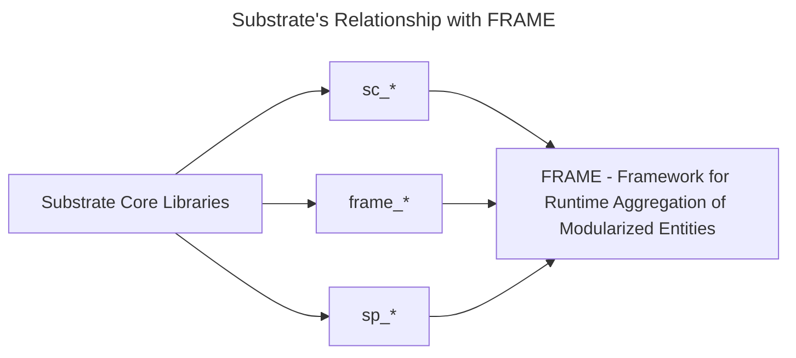

Substrate is a modular framework that enables you to create domain-specific blockchains by composing custom or pre-built components.  The *Framework for Runtime Aggregation of Modularized Entities (**FRAME**)* is a set of modules and support libraries that simplify runtime development.  In Substrate, these modules are called **pallets**, each hosting domain-specific logic to include in a chain's runtime.

Substrate may be utilized to create a solo chain and parachain for a relay chain like Polkadot (respectively).  At its core, it is a set of Rust crates that provide the most basic primitives and protocols to implement a distributed state machine, such as a blockchain.

Another way to think about Substrate is similar to how a web developer may use/think about React.  Where React provides core libraries for manipulating the elements of the DOM via developer-defined components, Substrate also provides the base libraries and primitives needed to create a blockchain.  It was designed to not be opinionated via a highly generic codebase, enabling high customizability.

:::info The prerequisites to learning Substrate

You should have good knowledge of computer science and basic blockchain concepts.  Terminology like header, **block**, **client**, **hash**, **transaction** and **signature** should be familiar. Substrate is built on the [Rust Programming language](https://www.rust-lang.org/), which makes use of novel design patterns to enable the development of code that is safe and fast.  Although you don't need to know Rust to start with Substrate, understanding Rust will allow you to become a better Substrate developer.

If you would like to brush up or learn the basics of Rust, feel free to take our [Intro to Rust course](../../introrust.md).

:::

## Substrate's Libraries

Substrate, as mentioned, is a collection of Rust crates that define a generic way to implement a blockchain.  Although you will only use a few of these libraries directly in this course, know that everything you use is built upon them. 

You will encounter two primary prefixes when developing with Substrate crates: `sc-` and `sp-`.  Crates prefixed with `sc-` usually refer to network-related functionalities, such as peer-to-peer networking or consensus.  The `sp-` prefix usually indicates that the library in question is for allowing the outer node and runtime to communicate. 

 A few significant crates that you will encounter are: 

- [`sp_runtime`](https://crates.parity.io/sp_runtime/index.html) - Runtime modules shared primitive types
- [`sp_core`](https://crates.parity.io/sp_core/index.html) - Shareable Substrate types
- [`sp_io`](https://crates.parity.io/sp_io/index.html) - I/O host interface for substrate runtime. Substrate runtime standard library as compiled when linked with Rust’s standard library.

These, along with many more, all pertain to building certain aspects of a particular distributed system.

## A Brief Introduction to FRAME (Framework for Runtime Aggregation of Modularized Entities)

A common question is: _If Substrate exists, what is FRAME for?  Why is it mentioned so often?_.

FRAME, or Framework for Runtime Aggregation of Modularized Entities, is another abstraction on top of Substrate.  It introduces a set of conventions and structures for building a blockchain with Substrate through numerous Rust macros.  These macros enable the powerful and trivial to use a system of **pallets** to construct **runtimes** using Substrate.  A **runtime**, also called a **state transition function (STF)**, defines the state transitions for a particular blockchain.  

Remember, a state machine is the core concept of a blockchain.  FRAME facilitates the way for state to propagate and change in a more developer-friendly way.

:::info

As we advance, terminologies such as **pallets**, and custom bundles of business logic that make up a runtime will be expected.  If a term here is unfamiliar and undefined, reference the glossary.

:::