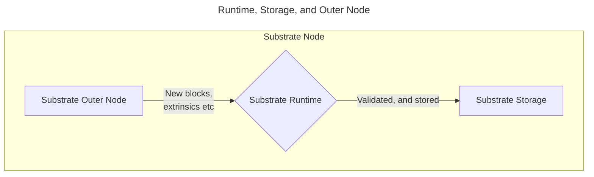

The runtime is essentially the heart of our blockchain.  It defines exactly how our blockchain will handle new data, whether or not it will react with a change in the network's state or not, and making calls to the storage and networking layers as needed.  Each runtime is actually a Wasm runtime, which is what enables for forkless upgrades to be possible.

It is also responsible for ensuring the validity of extrinsics, can compile WASM code for forkless upgrades, and most importantly for us — facilitates the usage of FRAME (**Framework for Runtime Aggregation of Modularized Entities**) to build and add pallets.  You can think of a runtime as the **engine** that facilitates the outer node (that ends up interacting with other nodes over the network) and storage to communicate, process, then store changes.

:::note

Because the runtime compiles down to a **Wasm** environment, this means that it is also a `no_std` environment.  For this reason, not all external Rust crates will work with a runtime unless they are able to work in a `no_std` environment.

:::

## The Outer Node

The outer node refers to the portion of a Substrate node that deals with peer-to-peer networking and receiving new incoming from nodes.  Through the use of **host functions**, it is able to pass this data as an opaque blob that is then decoded and processed by the runtime, where it is then stored in the underlying storage layer.
