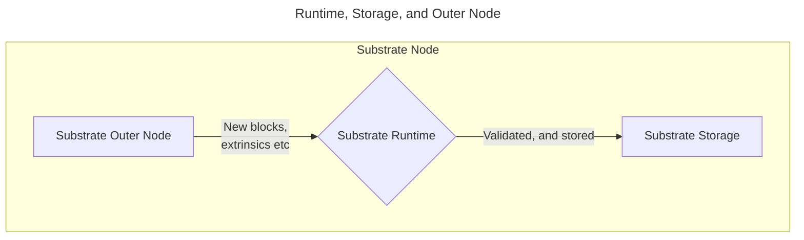

The runtime is the heart of our blockchain. It defines precisely how our blockchain will handle new
data, whether it will react to a change in the network's state, and communicates with storage and
networking layers as needed. Each runtime is a Wasm Virtual Machine. It is possible to update
runtime by modifying/replacing Wasm VM, which enables forkless upgrades on Substrate Blockchains to
be possible.

It is also responsible for ensuring the validity of extrinsics, can compile Wasm code for forkless
upgrades, and, most importantly for us — facilitates the usage of FRAME (**Framework for Runtime
Aggregation of Modularized Entities**) to build and add pallets. You can think of the runtime as the
**engine** that facilitates the outer node (that ends up interacting with other nodes over the
network) and storage to communicate, process, then store changes.

:::note

Because the runtime compiles to a **Wasm** environment, it is also a `no_std` environment. For this
reason, not all external Rust crates will work with a runtime unless they can work in a `no_std`
environment.

:::

## The Outer Node

The outer node refers to the portion of a Substrate node that deals with peer-to-peer networking and
receiving new incoming requests from nodes. Using **host functions**, it can pass this data as an
opaque blob that is then decoded and processed by the runtime, where it is then stored in the
underlying storage layer.
