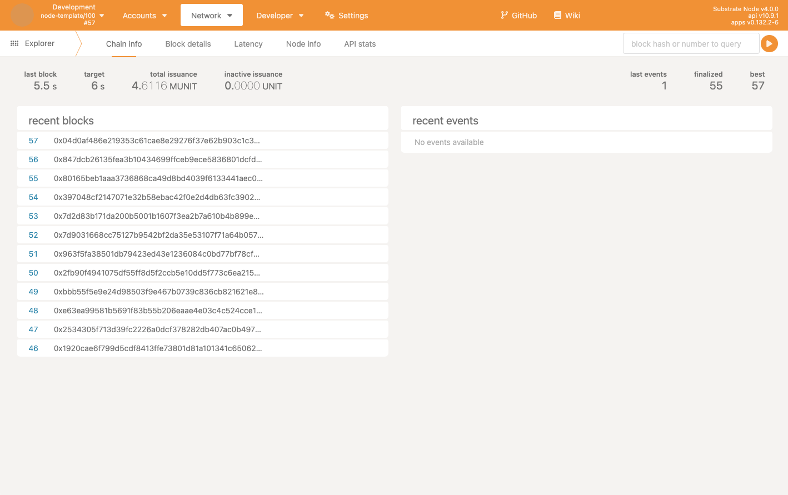
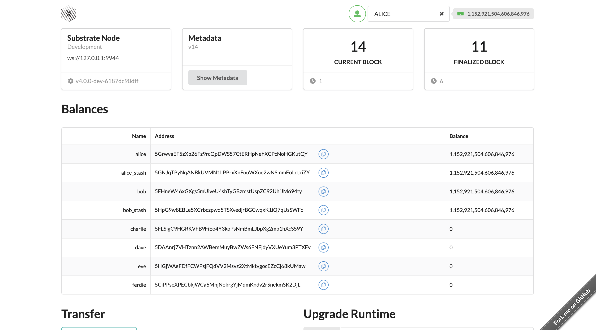

It’s time to download the Substrate Node Template. This repository will give us everything to run,
test, and create a custom FRAME-based pallet.

As a part of this course, a pre-configured pallet and node runtime are already provided for you,
which you will find here.

## Cloning & Building

You should already have the Rust toolset installed on your system. If not, go ahead and follow the
[instructions to install](https://docs.substrate.io/install/) and come back to this section.
Remember, this may take a bit to build and run, so feel free to get a cup of coffee or read an
awesome Medium article while you wait.

Remember that this repo is a clone from the original substrate-node-template, but with a few tweaks
to make it easier to work with when we start our pallet development.

```bash
git clone https://github.com/w3f/substrate-mooc-node
cd substrate-mooc-node/
# This will build and launch the node
# If you wish to just build it, then run cargo build --release
cargo run --release -- --dev
```

Once built, we have multiple ways of running and interacting with our node.

## Running & Viewing our Development Chain

For immediate results to ensure our chain is up, go ahead and visit the Polkadot.js Explorer:

[Polkadot/Substrate Portal](https://polkadot.js.org/apps/#/explorer?rpc=ws://localhost:9944)

This link will automatically connect to your `localhost` node, where you can view all chain stats.
For example, accounts, their balances, blocks, and on-chain events:



### Observing Chain State

By navigating to `Developer > Chain State`, it is possible to get the state of various storage
mappings or values previously defined by the pallets in the runtime. These are called **State
Queries.**

For example, you can select the `timestamp` state query and click the plus button on the far right
to get the time for the node:

### Modifying Chain State

Modifying the chain's state is done via **extrinsics** . An extrinsic is similar to the concept of a
transaction, as it represents a unit of change within a chain's particular state, i.e., transferring
currency that changes two users' balances.

You can also simply search storage by raw hexadecimal key. However, most of the time, it’s easier to
perform state queries via the respective pallet and its associated storage items.

## Using the `substrate-frontend-template`

While the explorer is an ideal place for general functions, the
[`substrate-frontend-template`](https://github.com/substrate-developer-hub/substrate-front-end-template)
is another way to interact with the node.

Navigate to where you installed it, and run `yarn start` (assuming you have run `yarn install` to
install its local dependencies):

This should launch the frontend, located at
[localhost:8000](http://localhost:8000/substrate-front-end-template):



You now have most functionality and access to your chain through a single-page GUI. For example, you
can use the `transfer` pallet to transfer currency between accounts, upgrade your runtime via a
forkless upgrade, and interact with pallets to modify the state of the chain directly.

Feel free to play around here and experiment as much as possible with this interface, as a lot can
be gleaned from observing this structure. If you notice in the dropdown — one of the pallets is
called `connect`.

On the next page, we’ll modify and go through this pallet to make it our own.
