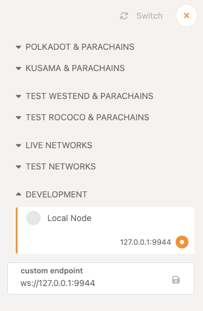

The [front-end template](https://github.com/substrate-developer-hub/substrate-front-end-template) is a valuable source that will allow us to quickly verify and test our Substrate chain with minimal interference.  

## Installation

```bash
# Clone the repository
git clone https://github.com/substrate-developer-hub/substrate-front-end-template.git
cd substrate-front-end-template
yarn install

# To start it
yarn start
```

More info can be found at the [repository](https://github.com/substrate-developer-hub/substrate-front-end-template).

## The Polkadot.js Explorer

The Polkadot.js explorer is also a great way for developers to get more insight into your node’s operations:

[Polkadot/Substrate Portal](https://polkadot.js.org/apps/#/explorer)

Once there, you can click the upper left, select `Development` at the bottom of the menu, select `Local Node`, and click `Switch` in the top right:



