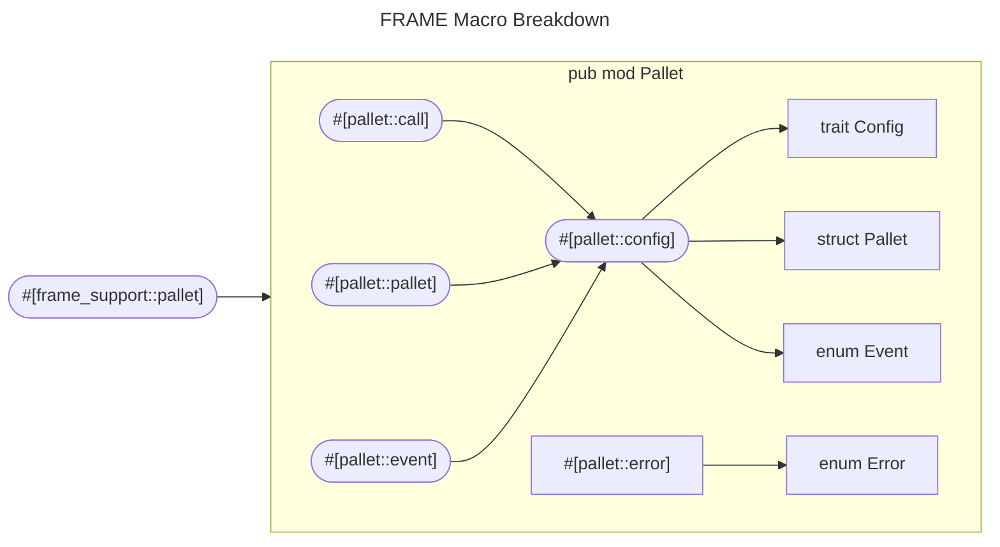

In the previous module, we did take a brief tour of the pallet under `pallets/connect`. We learned
that a pallet is just a Rust crate, which uses FRAME and its support libraries and macros to create
a valid pallet for a FRAME-based runtime. This lesson will take a deeper dive into how some of these
macros work, including the overall structure of a pallet.

## Crucial Macros

If we strip away the logic within `pallet_connect`, we come to see a bare `lib.rs`:

```rust
#![cfg_attr(not(feature = "std"), no_std)]

pub use pallet::*;

#[cfg(feature = "runtime-benchmarks")]
mod benchmarking;
pub mod weights;
pub use weights::*;

#[frame_support::pallet]
pub mod pallet {
    use super::*;
    use frame_support::pallet_prelude::*;
    use frame_system::pallet_prelude::*;

    #[pallet::pallet]
    pub struct Pallet<T>(_);

    #[pallet::config]
    pub trait Config: frame_system::Config {}

    #[pallet::event]
    #[pallet::generate_deposit(pub(super) fn deposit_event)]
    pub enum Event<T: Config> {}

    #[pallet::error]
    pub enum Error<T> {}

    #[pallet::call]
    impl<T: Config> Pallet<T> {}
```

Top-down, there are a few important macros to pay attention to:

- `#[frame_support::pallet]` - The pallet attribute macro defines a pallet that can be used with
  `construct_runtime!`.
- `#[pallet::pallet]` - The pallet struct placeholder, `#[pallet::pallet]` is mandatory and allows
  you to specify pallet information.
- `#[pallet::config]` - The mandatory attribute `#[pallet::config]` defines the configurable options
  for the pallet.
- `#[pallet::event]` - The `#[pallet::event]` attribute allows you to define pallet events.
- `#[pallet::error]` - The `#[pallet::error]` attribute allows you to define an error enum that will
  be returned from the dispatchable when an error occurs.
- `#[pallet::call]` - The `#[pallet::call]` attribute allows you to define ways to dispatch an
  extrinsic.

Each procedural macro generates and expands a piece of code related to the pallet. In terms of Rust,
you can see that the pallet is **first** declared as a module, then there is a struct, **Pallet**,
which is the revolving type that this pallet uses to apply its subsequent **Config** trait. Two
important enums, namely **Event** and **Error**, are also available. At a high level, these simply
define pallet-specific events or errors.



## Pallet Configuration - `Config<T>`

A common pattern you may notice is a seemingly ambiguous generic type: `T`. If you are unfamiliar
with generic types and their usage in Rust, below is a quick explanation of how they work in this
context.

### Use of generics and associated types

Remember that Substrate is built to be generic, saving the developer the pains of implementing
blockchain-related primitives from scratch. FRAME and Substrate both make use of two crucial
Rust-related concepts:

- [Macros](../../Rust/section7/macros.md)
- [Generics / Associated Types](../../Rust/section6/generics.md)

`T` refers to a generic or **placeholder** type. Where macros enable a relatively easy experience
implementing various mandatory functionality, generics allow the code to be highly configurable. The
`Config` trait uses generics to provide a generic implementation of an overarching configuration
which may derive many blockchain primitives therein.
