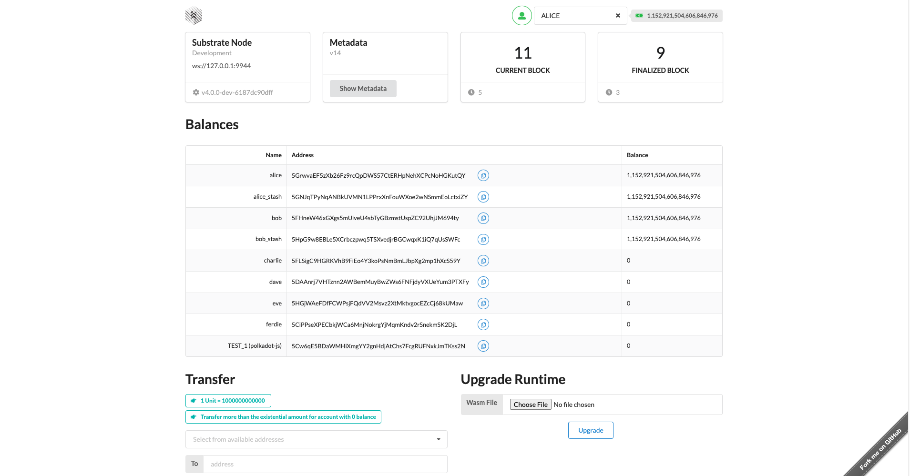
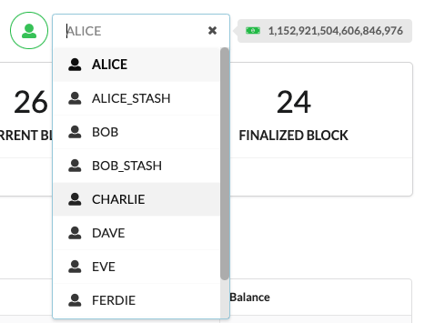
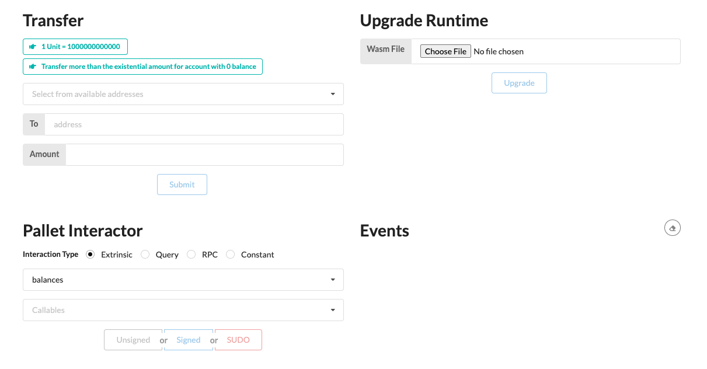
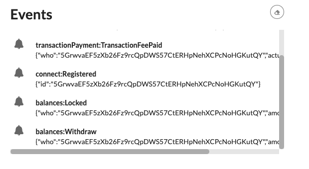
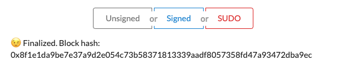
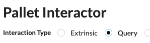
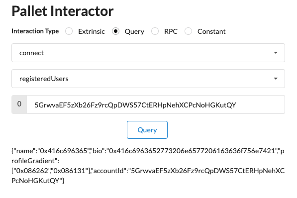

With your node running, launching the [frontend template](../section3/install-explore-frontend.md)
from the previous module would be a good idea. The frontend template will allow you to interact with
the node on a fundamental level while also accessing different functionality through the various
pallets, including our custom `connect` pallet.'

:::info Launch the frontend template

Make sure your node and the frontend template are running:

```bash
cd substrate-frontend-template/
yarn start
```

:::

## Quick tour

Located at `http://localhost:8000/substrate-frontend-template`, you should be greeted with this page
(as seen previously). It shows various network statistics regarding your node:




Using this template, we can also interact with our node using the **pallet interactor**. Be sure to
have the **ALICE** account selected, as it is pre-funded for sending extrinsics:



## Registering a user with the Pallet Interactor

The bottom half of the frontend template features the ability to perform forkless upgrades, the
pallet interactor, and an event viewer:



We will use the **pallet interactor** to register a new user to the network. Select the first
drop-down, select our pallet `connect`, then our `register` extrinsic in the second drop-down.
You'll notice two parameters: the name and bio, which are filled accordingly with text:


Once all parameters are filled, select `Signed`. This will send the transaction, or extrinsic, to be
confirmed in a block within our node.

Notice that the event view immediately emits several events indicating that our registration was
successful. The user has been registered, and the balance is locked and stored within the state.



Later, you should also see this below the pallet interactor, indicating that the network has
finalized the state change:



:::info What is signed, unsigned, and SUDO?

These three buttons represent different **origins** for the extrinsic. If you remember, we used the
macro `ensure_signed` within our pallet to indicate that we expect a signed extrinsic.

:::

## Querying state

To query state, make sure to select "Query" as the interaction type:



As before, select the `connect` pallet, enter the name "Alice" to query the user metadata for Alice,
and hit "Query":



Congratulations, our custom pallet works!
