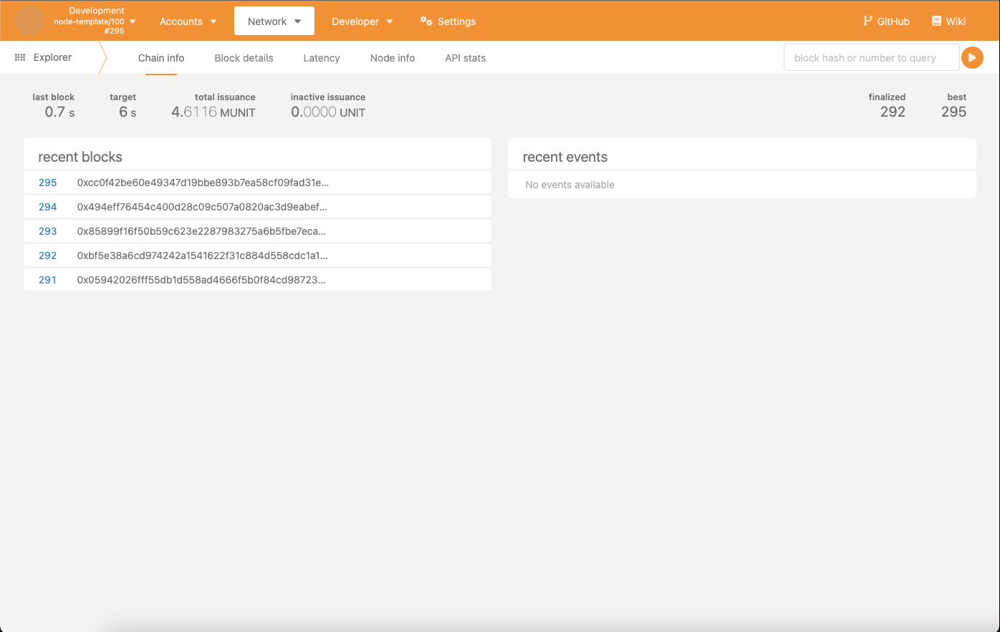
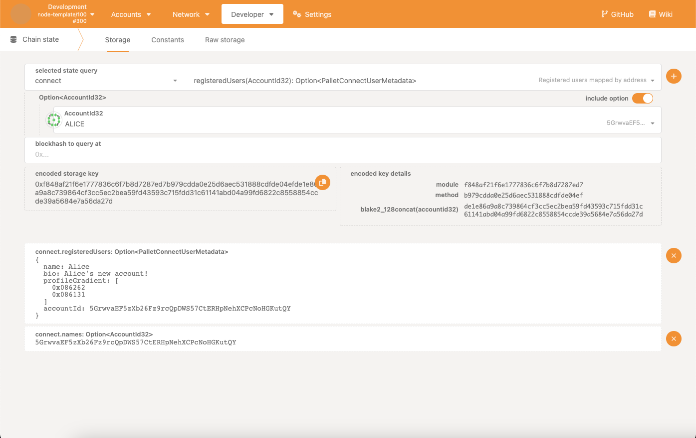
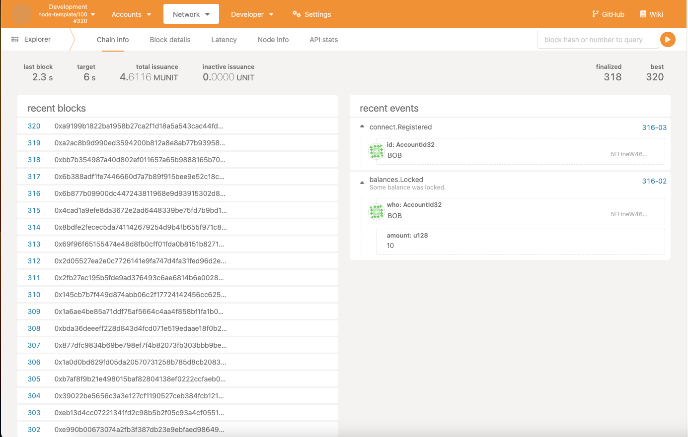

Although the `substrate-frontend-template` is convenient, in most development scenarios, you would
use [**Polkadot.js**](https://polkadot.js.org/apps/?rpc=ws%3A%2F%2F127.0.0.1%3A9944#/explorer).

With your node still running, navigate to the
[Polkadot.js Localhost](https://polkadot.js.org/apps/?rpc=ws%3A%2F%2F127.0.0.1%3A9944#/explorer):

This is a more real-time experience compared to the frontend template. Note the events viewer on the
right, which will soon be populated!

## Getting detailed storage

Navigate to the `Developer > Chain state` tab, and select the `connect` pallet from the dropdown.
Just as before, we can query the "Alice" name we registered before:

## Sending an extrinsic and viewing events: Polkadot.js edition

Navigate to the `Developer > Extrinsics` tab, and select the **BOB** account from the list of
accounts. s Select the `connect` pallet from the dropdown, and the `register` extrinsic from the
dropdown to the right:

Fill out the details for the parameters in their respective fields, and press **Submit transaction**
in the bottom right. Once you finish this, you should see two events emit in the
`Network > Explorer` tab:

