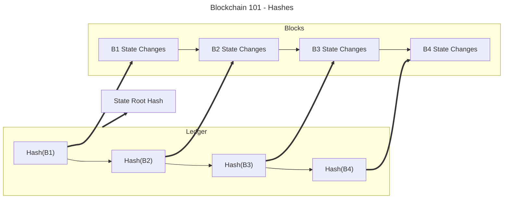

If you have come from a web2 background, it can be a learning curve to "think like a blockchain
developer".

While this course merely touches on the more surface-level capabilities of Substrate, there are some
critical practices and concepts to remember when starting your journey to develop blockchains with
Substrate.

## On Cryptography - "Don't roll your own crypto"

It is important to abide by the general rule of thumb of **"not rolling your own crypto"**. Use
established or community-approved algorithms.

Whether it is apparent or not, all blockchain-based systems rely heavily on various cryptographic
methods to track, verify, and provide the integrity blockchains intrinsically offer.

As we've seen with the `StorageMap` implementation, we used the Blake2 hashing algorithm to hash our
storage keys, or more important; we require an extrinsic to be a cryptographically valid, signed
payload that represents that specific call. The blockchain itself relies on a series of hashes that
build on each other to form the infamous, verifiable ledger that is the blockchain.

Not using approved cryptography within your chain could make it fundamentally insecure and
vulnerable to attack.

## On Storage - Blockchains aren't just databases

There is a common misconception that a blockchain is simply a distributed database; with that
thinking, any data can be put on the blockchain. When developing a pallet or dApp, it is important
to realize **do not store data, but rather a representation of it**.

:::info A real-world example: Video on blockchain

In this hypothetical scenario, a platform wishes to gate access to a video streaming platform unless
certain NFTs are owned. Video is a computationally expensive to store and manage - so would the
blockchain instance store each video?

**The answer is no.** In most cases, the blockchain merely **points** to the content but doesn't
store it on the network.

:::

As we've seen, blockchains are not simply just a database - they represent an autonomous way to
agree upon the state of some network. In order to agree on this state of the network, each node must
hold some semblance of a copy of the network. In many cases, full nodes bear the brunt of the load
when it comes to proving the state and providing access to it. Moreover, storing data on-chain is
"expensive". While fees aren't an issue in our developmental network, a network like Polkadot
requires a fee for a state change. The more data in that state change, the more computation and
storage it will cost the network.
