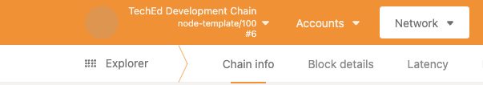

The **chain specification** describes any Substrate-based network.  Located in `node/src/chain_spec.rs`, the chain specification describes the inital state of the network via the `ChainSpec` struct, which is usually exported as a JSON file using the `substrate build-spec` command.

As you may have noticed, when we start our chain in developmental mode, we have a set of pre-defined, funded accounts.  This is located inside `chain_spec.rs` where default accounts, the chain's name, id, sudo accounts, and more are defined.

## `chain_spec.rs` Overview

The `chain_spec.rs` file describes a Substrate-based chain.  It includes numerous functions, each of which define a particular aspect of the configuration.  The most notable functions are:

- `fn testnet_genesis()` -> Defines the initial state for pallets, including the Wasm runtime.  
- `fn development_config()` -> Defines the developmental instance of the node. Uses `testnet_genesis()` to configure the state of the development state.

:::info Why does my chain progress in development mode with only one node?

If you have run `cargo run --release` on its own, and the chain doesn't progress, that's because it requires at least two authorities to start authoring blocks.  The developmental configuration only requires a single validator, `Alice`.

:::

## Modifying Your Chain Spec

It is possible to modify these functions to define a different initial state for your chain.  New authorities for validation could be added, fund other accounts other than the "well-known" accounts, and any registered pallets' initial state can be modified in general.

### Example: Changing the name of your chain

Navigate to `development_config()`, and find the following lines:

```rust
pub fn development_config() -> Result<ChainSpec, String> {
	let wasm_binary = WASM_BINARY.ok_or_else(|| "Development wasm not available".to_string())?;

	Ok(ChainSpec::from_genesis(
		// Name
		"Development",
...
```

Go ahead and change name to whatever you like. By the end, it should look like this: 

```rust
pub fn development_config() -> Result<ChainSpec, String> {
	let wasm_binary = WASM_BINARY.ok_or_else(|| "Development wasm not available".to_string())?;

	Ok(ChainSpec::from_genesis(
		// Name
		"TechEd Development Chain",
...
```

If you run your node and navigate to Polkadot.js, it should show in the upper left:


